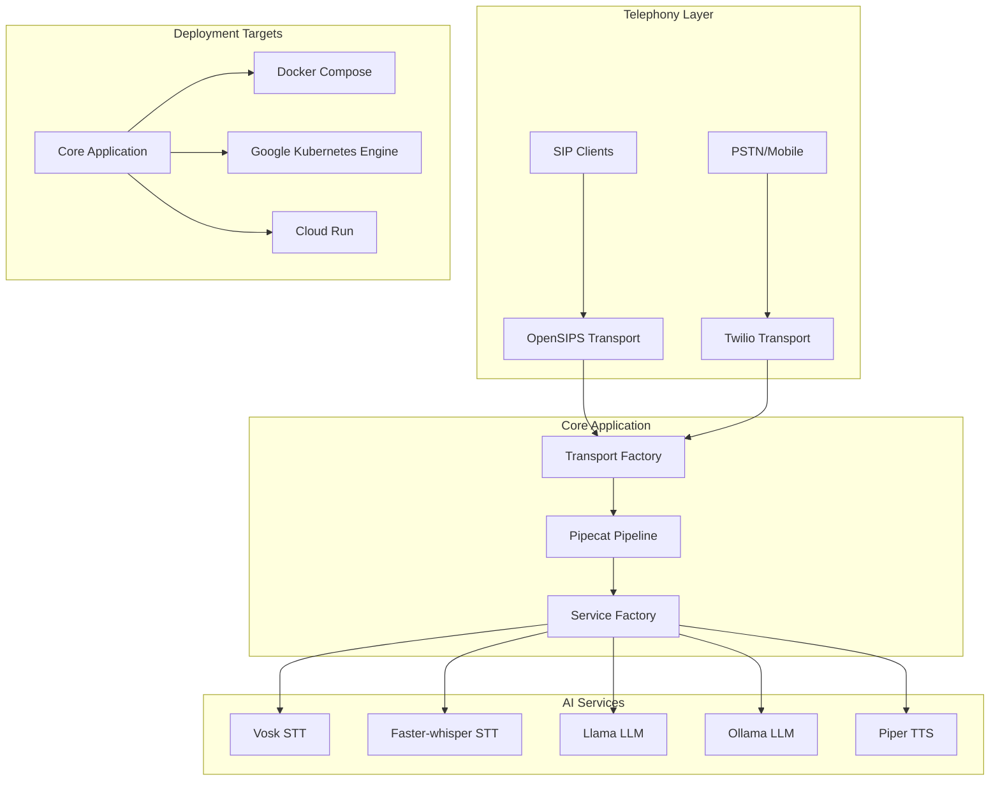

# OpenSIPS AI Voice Connector - Cloud-Native Multi-Provider Architecture

## Introduction

This document outlines the architectural approach for enhancing the OpenSIPS AI Voice Connector with cloud-native deployment capabilities, multi-provider telephony support (Twilio), and enhanced AI services (Ollama, Faster-whisper). Its primary goal is to serve as the guiding architectural blueprint for AI-driven development of new features while ensuring seamless integration with the existing system.

**Relationship to Existing Architecture:**
This document supplements the existing project architecture by defining how new components will integrate with current systems. Where conflicts arise between new and existing patterns, this document provides guidance on maintaining consistency while implementing enhancements.

### Existing Project Analysis

#### Current Project State
- **Primary Purpose:** Real-time AI voice processing with VAD → STT → LLM → TTS pipeline
- **Current Tech Stack:** Python 3.11+, Pipecat (local fork), OpenSIPS 3.6, Docker Compose
- **Architecture Style:** Simplified monolithic with containerized AI services, per-call bot instances
- **Deployment Method:** Docker Compose on local/VM infrastructure

#### Available Documentation
- Brownfield architecture analysis (docs/brownfield-architecture.md)
- Configuration documentation (cfg/opensips-ai-voice-connector.ini)
- Docker deployment setup (docker-compose.dev.yml)
- Pipecat framework examples including Twilio pattern

#### Identified Constraints
- Pipecat framework is a local fork, not standard package
- Turkish language models currently hardcoded
- OpenSIPS tightly coupled for telephony
- Fixed RTP port range (35000-35500)
- All services must run together (monolithic deployment)

### Change Log

| Change | Date | Version | Description | Author |
|--------|------|---------|-------------|---------|
| Initial | 2025-01-07 | 1.0 | Created modernization architecture | Architect |

## Enhancement Scope and Integration Strategy

### Enhancement Overview
**Enhancement Type:** Architecture Modernization with Multi-Provider Support
**Scope:** Add cloud deployment, Twilio telephony, Ollama LLM, Faster-whisper STT
**Integration Impact:** Major - requires new abstraction layers while maintaining backward compatibility

### Integration Approach
**Code Integration Strategy:** Factory pattern for providers, maintain existing interfaces
**Database Integration:** N/A - Maintain stateless design
**API Integration:** Add FastAPI layer alongside existing datagram interfaces
**Deployment Integration:** Support both Docker Compose and Kubernetes deployments

### Integration Points
- Transport layer: Abstract base class for OpenSIPS/Twilio
- Service layer: Factory pattern for AI providers
- Configuration: Extended INI with provider selection
- Deployment: Multi-target Docker builds

## High-Level Architecture

### Architectural Principles
1. **Provider Agnostic**: All telephony and AI services behind abstractions
2. **Configuration Driven**: Provider selection via configuration, not code changes
3. **Backward Compatible**: Existing deployments continue without modification
4. **Cloud Native**: Designed for Kubernetes and serverless deployments
5. **Stateless Design**: Maintain stateless architecture for horizontal scaling

### System Architecture Diagram



### Component Architecture

```yaml
components:
  transport_layer:
    - name: TransportBase
      type: abstract_class
      responsibility: Define common transport interface
    - name: OpenSIPSTransport
      type: implementation
      inherits: TransportBase
      protocol: RTP/UDP
    - name: TwilioTransport
      type: implementation
      inherits: TransportBase
      protocol: WebSocket/Media Streams
    - name: TransportFactory
      type: factory
      responsibility: Provider selection based on config

  service_layer:
    - name: STTServiceBase
      type: abstract_class
      responsibility: Define STT interface
    - name: VoskSTTService
      inherits: STTServiceBase
      protocol: WebSocket
    - name: FasterWhisperSTTService
      inherits: STTServiceBase
      protocol: In-process
    - name: LLMServiceBase
      type: abstract_class
    - name: LlamaLLMService
      inherits: LLMServiceBase
      protocol: WebSocket
    - name: OllamaLLMService
      inherits: LLMServiceBase
      protocol: REST/HTTP
    - name: ServiceFactory
      type: factory
      responsibility: AI provider selection

  pipeline_layer:
    - name: PipelineMana ger
      type: orchestrator
      responsibility: Coordinate frame processing
    - name: AudioProcessor
      responsibility: Handle codec conversion
    - name: InterruptionHandler
      responsibility: Barge-in detection
```

## Detailed Design

### Multi-Provider Transport Architecture

#### Transport Factory Pattern
```python
# Abstract base transport
class TransportBase(ABC):
    @abstractmethod
    async def connect(self): pass
    @abstractmethod
    async def send_audio(self, frames): pass
    @abstractmethod
    async def receive_audio(self): pass

# Factory implementation
class TransportFactory:
    @staticmethod
    def create_transport(config: dict) -> TransportBase:
        provider = config.get('telephony_provider', 'opensips')
        if provider == 'opensips':
            return OpenSIPSTransport(config)
        elif provider == 'twilio':
            return TwilioTransport(config)
        raise ValueError(f"Unknown provider: {provider}")
```

#### Twilio Integration Architecture
- FastAPI WebSocket endpoint at `/ws`
- TwilioFrameSerializer for Media Stream protocol
- 8kHz PCMU audio handling
- TwiML response generation for call control

#### OpenSIPS Integration (Existing)
- MI Datagram for control
- Event Datagram for notifications
- RTP transport on ports 35000-35500
- PCMU/PCMA codec support

### Multi-Provider AI Services

#### Service Factory Pattern
```python
class ServiceFactory:
    @staticmethod
    def create_stt_service(config: dict) -> STTServiceBase:
        provider = config.get('stt_provider', 'vosk')
        if provider == 'vosk':
            return VoskSTTService(config)
        elif provider == 'faster-whisper':
            return FasterWhisperSTTService(config)
            
    @staticmethod
    def create_llm_service(config: dict) -> LLMServiceBase:
        provider = config.get('llm_provider', 'llama')
        if provider == 'llama':
            return LlamaLLMService(config)
        elif provider == 'ollama':
            return OllamaLLMService(config)
```

#### Ollama Integration
- REST API at `http://ollama:11434/api/generate`
- Streaming response handling
- Model management via API
- Support for multiple models

#### Faster-whisper Integration
- In-process model loading
- Audio buffering for batch processing
- Multi-language support
- GPU acceleration optional

### Cloud Deployment Architecture

#### Container Structure
```yaml
containers:
  main_application:
    base: python:3.11-slim
    multi_stage: true
    size_target: <500MB
    
  ollama_service:
    base: ollama/ollama
    models: mounted_volume
    
  faster_whisper:
    base: python:3.11-slim
    includes: whisper_models
```

#### Kubernetes Architecture (GKE)
```yaml
deployments:
  main_app:
    replicas: 3-10
    autoscaling:
      target_cpu: 70%
      target_memory: 80%
    resources:
      requests:
        cpu: 500m
        memory: 1Gi
      limits:
        cpu: 2000m
        memory: 2Gi
        
  ollama:
    replicas: 2-5
    gpu_enabled: optional
    persistent_volume: true
    
  faster_whisper:
    replicas: 2-5
    model_cache: persistent_volume
```

#### Cloud Run Architecture
- Stateless Twilio-only deployment
- Request-based autoscaling
- Cold start optimization (<5s)
- Environment variable configuration

### Configuration Architecture

#### Extended INI Schema
```ini
[telephony]
provider = twilio|opensips|both
fallback_provider = opensips

[telephony.twilio]
account_sid = ${TWILIO_ACCOUNT_SID}
auth_token = ${TWILIO_AUTH_TOKEN}
phone_number = +1234567890

[telephony.opensips]
event_ip = 0.0.0.0
event_port = 8090
rtp_port_start = 35000
rtp_port_end = 35500

[stt]
provider = vosk|faster-whisper
fallback_provider = vosk

[stt.faster-whisper]
model_size = base|small|medium|large
language = tr|en|auto
device = cpu|cuda

[llm]
provider = llama|ollama
fallback_provider = llama

[llm.ollama]
base_url = http://ollama:11434
model = llama3.2:3b
temperature = 0.7
```

## Data Flow

### Call Flow - Twilio Path
1. Twilio receives PSTN call → POST to `/`
2. Return TwiML with WebSocket stream URL
3. WebSocket connection established at `/ws`
4. Receive Media Stream messages
5. Process through Pipecat pipeline
6. Send audio back via Media Stream

### Call Flow - OpenSIPS Path
1. SIP INVITE received by OpenSIPS
2. Event notification to application
3. Establish RTP streams
4. Process through Pipecat pipeline
5. Send audio via RTP

### Audio Processing Pipeline
```
Input Audio → VAD → STT Provider → Text
Text → LLM Provider → Response Text
Response Text → TTS → Output Audio
```

## Security Architecture

### Authentication & Authorization
- Twilio: Signature validation for webhooks
- OpenSIPS: IP-based access control
- API Keys: Stored in Cloud Secrets Manager
- Service-to-service: mTLS in Kubernetes

### Data Protection
- TLS for all external communications
- No audio recording by default
- Configurable PII masking
- Audit logging for compliance

## Performance & Scaling

### Performance Targets
- Call setup: <2 seconds
- Audio latency: <500ms
- Interruption response: <300ms
- Concurrent calls: 100+ per instance

### Scaling Strategy
- Horizontal scaling for stateless components
- Session affinity for active calls
- Pre-warmed instances for cold starts
- Circuit breakers for provider failures

## Deployment Strategy

### Phase 1: Local Development
- Docker Compose with all providers
- Provider switching via configuration
- Integration testing setup

### Phase 2: Staging Deployment
- GKE cluster setup
- CI/CD pipeline with Cloud Build
- Monitoring integration

### Phase 3: Production Rollout
- Blue-green deployment
- Canary releases for new providers
- Rollback procedures

## Migration Path

### Step 1: Add Provider Abstractions
- Implement factory patterns
- Maintain existing functionality
- Test with current deployment

### Step 2: Integrate New Providers
- Add Twilio transport
- Add Ollama service
- Add Faster-whisper service

### Step 3: Cloud Preparation
- Create container images
- Setup Kubernetes manifests
- Configure secrets management

### Step 4: Cloud Deployment
- Deploy to GKE
- Setup monitoring
- Gradual traffic migration

## Risk Mitigation

### Technical Risks
- **Pipecat Fork Divergence**: Maintain compatibility layer
- **Provider Failures**: Implement fallback providers
- **Network Latency**: Edge deployment options

### Operational Risks
- **Complexity Increase**: Comprehensive documentation
- **Configuration Errors**: Validation on startup
- **Monitoring Gaps**: Unified observability platform

## Appendix

### File Structure
```
src/
├── transports/
│   ├── base.py              # Abstract transport
│   ├── opensips_transport.py # Existing
│   ├── twilio_transport.py   # New
│   └── factory.py           # New
├── services/
│   ├── base.py              # Abstract services
│   ├── vosk_websocket.py    # Existing
│   ├── llama_websocket.py   # Existing
│   ├── piper_websocket.py   # Existing
│   ├── ollama_service.py    # New
│   ├── faster_whisper.py    # New
│   └── factory.py           # New
├── api/
│   ├── __init__.py          # New
│   ├── twilio_webhook.py    # New
│   └── health.py            # New
└── config/
    ├── providers.py         # New
    └── cloud.py            # New
```

### Configuration Examples
- Development: `config/dev.ini`
- Twilio-only: `config/twilio.ini`
- GKE production: `config/gke.ini`
- Cloud Run: `config/cloudrun.ini`

### Testing Strategy
- Unit tests for each provider
- Integration tests for provider combinations
- Load testing for cloud deployments
- Chaos testing for failover scenarios