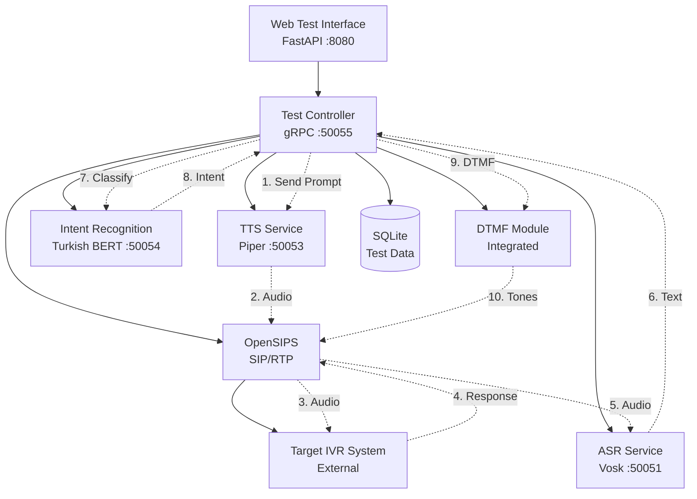

# IVR Flow Automation System Brownfield Enhancement Architecture

## Introduction

This document outlines the architectural approach for enhancing the OpenSIPS AI Voice Connector with IVR Flow Automation System capabilities. Its primary goal is to serve as the guiding architectural blueprint for AI-driven development of new features while ensuring seamless integration with the existing system.

**Relationship to Existing Architecture:**
This document supplements existing project architecture by defining how new components will integrate with current systems. Where conflicts arise between new and existing patterns, this document provides guidance on maintaining consistency while implementing enhancements.

### Existing Project Analysis

**Current Project State:**
- **Primary Purpose:** Real-time AI voice processing system for telephony applications with sub-700ms latency
- **Current Tech Stack:** Python 3.9+, gRPC microservices (ASR/Vosk, LLM/LLaMA, TTS/Piper), OpenSIPS, Docker, Pipecat framework
- **Architecture Style:** Microservices architecture with gRPC communication and Docker containerization
- **Deployment Method:** Docker Compose with health checks and service dependency management

**Available Documentation:**
- Existing README.md with comprehensive project structure
- Docker compose configurations for dev/prod environments
- gRPC service implementations and protobuf definitions
- Comprehensive testing framework with pytest

**Identified Constraints:**
- Must maintain existing ASR/TTS service functionality
- CPU-only deployment requirement (no GPU dependencies)
- Existing OpenSIPS integration must be preserved during transformation
- Current service port allocation and network configuration

## Enhancement Scope and Integration Strategy

### Enhancement Overview
**Enhancement Type:** Service Purpose Transformation + CPU-Only Architecture  
**Scope:** Convert to outbound IVR testing with CPU-based Turkish BERT intent recognition  
**Integration Impact:** Major - Remove LLM completely, add CPU-optimized Intent Recognition service

### Integration Approach
**Code Integration Strategy:** 
- Remove LLM service completely (no streaming, no real-time conversation)
- Add simple Intent Recognition service: **text input → intent classification output**
- Maintain existing ASR service for IVR response transcription
- Maintain existing TTS service for sending prompts to IVR
- Add Test Controller service for orchestrating test scenarios

**API Integration Pattern:**
```
Test Flow: TTS → IVR → ASR → Intent Recognition → Test Validation
          (send prompt) (response) (transcribe) (classify) (pass/fail)
```

**Database Integration:** Add SQLite for test scenarios, results, and intent training data, maintaining separation from existing data flows

**UI Integration:** New web interface for test management replacing conversational interface

### Compatibility Requirements
**Existing API Compatibility:** Remove LLM service dependencies, maintain ASR/TTS patterns  
**Database Schema Compatibility:** No changes to existing data, add new test-specific schemas  
**UI/UX Consistency:** Complete interface replacement for test management vs. conversation  
**Performance Impact:** Reduced resource usage without LLM, faster intent recognition responses

## Tech Stack Alignment

### Existing Technology Stack

| Category | Current Technology | Version | Usage in Enhancement | Notes |
|----------|-------------------|---------|---------------------|-------|
| **Core Language** | Python | 3.9+ | All services and core application | Maintained |
| **Service Communication** | gRPC/protobuf | 1.60.0/4.25.1 | ASR, TTS, Intent Recognition, Test Controller | Existing pattern extended |
| **Web Framework** | FastAPI | 0.108.0 | Test management web interface | Existing pattern reused |
| **Containerization** | Docker/Docker Compose | Latest | All services including new Intent & Test Controller | Existing pattern extended |
| **Audio Processing** | numpy, soundfile, scipy | 2.2.5, 0.12.1, 1.15.2 | RTP audio handling for IVR calls | Maintained |
| **ASR Engine** | Vosk | 0.3.45 | IVR response transcription | Maintained as-is |
| **TTS Engine** | Piper | 1.2.0 | IVR prompt generation | Maintained as-is |
| **SIP/Telephony** | OpenSIPS | Custom integration | **Modified for outbound calls** | Reconfigured |
| **Configuration** | configparser, pydantic | 6.0.0, 2.10.4 | Test scenario and service config | Maintained |
| **Testing** | pytest suite | 8.2.1+ | Extended for IVR test validation | Extended |

### New Technology Additions

| Technology | Version | Purpose | Rationale | Integration Method |
|------------|---------|---------|-----------|-------------------|
| **Turkish BERT** | dbmdz/bert-base-turkish-uncased | Intent classification from IVR responses | CPU-optimized, Turkish language support for IVR testing | New gRPC service (port 50054) |
| **Transformers** | Latest stable | BERT model loading and inference | Required for Turkish BERT | New Intent Recognition service |
| **SQLite** | Built-in Python | Test scenarios, results, intent training data | Lightweight, no additional infrastructure | New database files |
| **ONNX Runtime** | 1.19.2 | CPU-optimized BERT inference | Already in requirements, optimize Turkish BERT | Existing dependency |

## Data Models and Schema Changes

### New Data Models

#### Test Scenario Model
**Purpose:** Define automated IVR test scenarios with step-by-step execution plans  
**Integration:** Independent from existing voice assistant data, stored in new SQLite database

**Key Attributes:**
- `scenario_id`: INTEGER PRIMARY KEY - Unique test scenario identifier
- `name`: TEXT NOT NULL - Human-readable scenario name
- `description`: TEXT - Detailed scenario description
- `target_phone`: TEXT NOT NULL - IVR system phone number to test
- `steps`: JSON - Array of test steps with prompts, expected intents, DTMF sequences
- `timeout_seconds`: INTEGER DEFAULT 300 - Scenario execution timeout
- `created_at`: TIMESTAMP - Creation timestamp
- `updated_at`: TIMESTAMP - Last modification timestamp

**Relationships:**
- **With Existing:** None (completely independent from current voice assistant data)
- **With New:** One-to-many with TestExecution, one-to-many with TestStep

#### Test Execution Model
**Purpose:** Track individual test scenario execution instances and results  
**Integration:** Links test scenarios to actual execution outcomes

**Key Attributes:**
- `execution_id`: INTEGER PRIMARY KEY - Unique execution identifier  
- `scenario_id`: INTEGER FOREIGN KEY - References test scenario
- `status`: TEXT CHECK (status IN ('running', 'completed', 'failed', 'timeout')) - Execution status
- `start_time`: TIMESTAMP - Execution start time
- `end_time`: TIMESTAMP - Execution completion time
- `call_id`: TEXT - OpenSIPS call identifier for correlation
- `final_result`: TEXT CHECK (final_result IN ('pass', 'fail')) - Overall test result
- `error_message`: TEXT - Error details if execution failed

#### Intent Training Data Model
**Purpose:** Store and manage Turkish BERT training data for IVR-specific intents
**Integration:** Supports intent recognition service training and validation

**Key Attributes:**
- `training_id`: INTEGER PRIMARY KEY - Training data identifier
- `text_sample`: TEXT NOT NULL - IVR response text sample
- `intent_label`: TEXT NOT NULL - Assigned intent classification
- `confidence_threshold`: REAL DEFAULT 0.85 - Minimum confidence for this intent
- `source`: TEXT - Data source (manual, recorded, synthetic)
- `validation_status`: TEXT CHECK (validation_status IN ('pending', 'validated', 'rejected')) - Training data quality
- `created_at`: TIMESTAMP - Data creation timestamp

### Schema Integration Strategy
**Database Changes Required:**
- **New Tables:** test_scenarios, test_executions, step_executions, intent_training_data
- **Modified Tables:** None (completely isolated from existing system)
- **New Indexes:** scenario_id, execution_id, call_id, intent_label for performance
- **Migration Strategy:** New SQLite database file(s), no impact on existing data

**Backward Compatibility:**
- No changes to existing voice assistant data structures
- Complete isolation of test-related data from conversation data
- Existing services (ASR, TTS) continue operating without schema awareness
- New services operate on new database schemas only

## Component Architecture

### New Components

#### Test Controller Service
**Responsibility:** Orchestrate end-to-end IVR test execution, coordinate between all services, and manage test state  
**Integration Points:** OpenSIPS (call initiation), ASR Service (transcription), TTS Service (prompts), Intent Recognition Service (validation), Web Interface (API)

**Key Interfaces:**
- `StartTestExecution(scenario_id)` → `execution_id`
- `GetExecutionStatus(execution_id)` → `TestExecutionStatus`
- `StopTestExecution(execution_id)` → `StopResult`
- `ListActiveExecutions()` → `List[ExecutionSummary]`

**Dependencies:**
- **Existing Components:** ASR Service (50051), TTS Service (50053), OpenSIPS SIP backend
- **New Components:** Intent Recognition Service (50054)

**Technology Stack:** Python FastAPI + gRPC client integrations, SQLite for test state, port 50055

#### Intent Recognition Service  
**Responsibility:** Classify IVR response transcripts using CPU-optimized Turkish BERT model  
**Integration Points:** Test Controller (classification requests), Training Data Management (model updates)

**Key Interfaces:**
- `ClassifyIntent(text)` → `IntentResult{intent, confidence}`
- `BatchClassify(texts[])` → `List[IntentResult]`
- `UpdateModel(training_data)` → `ModelUpdateResult`
- `GetSupportedIntents()` → `List[Intent]`

**Dependencies:**
- **Existing Components:** None (standalone text classification)
- **New Components:** Test Controller Service

**Technology Stack:** Python + Transformers + ONNX Runtime, Turkish BERT (dbmdz/bert-base-turkish-uncased), gRPC server on port 50054

#### Web Test Management Interface
**Responsibility:** Provide web UI for creating test scenarios, monitoring executions, and viewing results  
**Integration Points:** Test Controller Service (all test operations), SQLite (direct read access for reporting)

**Key Interfaces:**
- REST API endpoints for test scenario CRUD operations
- WebSocket connections for real-time test execution monitoring  
- File upload for training data management
- Dashboard views for test results and analytics

**Dependencies:**
- **Existing Components:** None (new web interface)
- **New Components:** Test Controller Service (primary API)

**Technology Stack:** FastAPI web framework, HTML/CSS/JavaScript frontend, WebSocket for real-time updates, port 8080 (reusing existing port)

#### DTMF Generation Module
**Responsibility:** Generate and send DTMF tones during test calls for IVR navigation  
**Integration Points:** Test Controller (DTMF commands), OpenSIPS (RTP stream injection)

**Key Interfaces:**
- `SendDTMF(call_id, tone_sequence, timing)` → `DTMFResult`
- `SendDTMFWithDelay(call_id, tone, delay_ms)` → `DTMFResult`
- `ValidateDTMFCapability(call_id)` → `CapabilityResult`

**Dependencies:**
- **Existing Components:** OpenSIPS RTP transport, Core RTP handling
- **New Components:** Test Controller Service

**Technology Stack:** Python audio processing, RTP tone injection, integrated into Test Controller service

### Component Interaction Diagram



## API Design and Integration

### API Integration Strategy
**API Integration Strategy:** Extend existing gRPC microservices pattern with new Test Controller and Intent Recognition services, maintaining consistency with current ASR/TTS service APIs

**Authentication:** Leverage existing service-to-service communication patterns, no authentication between internal services (consistent with current architecture)

**Versioning:** Follow existing protobuf versioning approach, new services start at v1 with backward compatibility considerations

### New API Endpoints

#### Test Controller gRPC Service

##### StartTestExecution
- **Method:** POST
- **Endpoint:** `TestController/StartTestExecution`
- **Purpose:** Initiate automated IVR test scenario execution
- **Integration:** Creates new test execution record, initiates OpenSIPS outbound call

**Request:**
```protobuf
message StartTestExecutionRequest {
    int32 scenario_id = 1;
    map<string, string> execution_params = 2;
    int32 timeout_override_seconds = 3;
}
```

**Response:**
```protobuf
message StartTestExecutionResponse {
    int32 execution_id = 1;
    string call_id = 2;
    TestExecutionStatus status = 3;
    int64 start_timestamp = 4;
}
```

#### Intent Recognition gRPC Service

##### ClassifyIntent
- **Method:** POST
- **Endpoint:** `IntentRecognition/ClassifyIntent`
- **Purpose:** Classify single IVR response text into intent categories
- **Integration:** Receives ASR transcription, returns intent classification for test validation

**Request:**
```protobuf
message ClassifyIntentRequest {
    string text = 1;
    float confidence_threshold = 2;
    repeated string candidate_intents = 3;
}
```

**Response:**
```protobuf
message ClassifyIntentResponse {
    string intent = 1;
    float confidence = 2;
    repeated IntentScore alternative_intents = 3;
    bool meets_threshold = 4;
}
```

## Source Tree Integration

### New File Organization

```plaintext
opensips-ai-voice-connector/
├── core/                           # Existing core - preserved
│   ├── grpc_clients/               # Existing gRPC clients
│   │   ├── asr_client.py          # Existing - preserved
│   │   ├── tts_client.py          # Existing - preserved
│   │   ├── test_controller_client.py  # NEW - Test Controller client
│   │   └── intent_client.py       # NEW - Intent Recognition client
│   ├── opensips/                   # Existing OpenSIPS integration
│   │   ├── integration.py         # Existing - modified for outbound calls
│   │   ├── outbound_call_manager.py # NEW - Outbound call management
│   │   └── dtmf_generator.py      # NEW - DTMF tone generation
│   ├── ivr_testing/               # NEW - IVR testing core
│   │   ├── __init__.py
│   │   ├── test_executor.py       # Test execution orchestration
│   │   ├── scenario_manager.py    # Test scenario management
│   │   └── result_processor.py    # Test result processing
│   └── web/                       # NEW - Web interface
│       ├── __init__.py
│       ├── app.py                 # FastAPI web application
│       ├── routers/               # API route handlers
│       │   ├── scenarios.py      # Test scenario endpoints
│       │   ├── executions.py     # Test execution endpoints
│       │   └── monitoring.py     # Real-time monitoring
│       └── static/                # Static web assets
├── services/                      # Existing services directory
│   ├── asr-service/              # Existing ASR service - preserved
│   ├── tts-service/              # Existing TTS service - preserved
│   ├── intent-service/           # NEW - Intent Recognition service
│   │   ├── Dockerfile
│   │   ├── requirements.txt
│   │   ├── src/
│   │   │   ├── main.py
│   │   │   ├── intent_grpc_server.py
│   │   │   ├── turkish_bert_engine.py
│   │   │   └── intent_service_pb2.py
│   │   └── tests/
│   └── test-controller-service/  # NEW - Test Controller service
│       ├── Dockerfile
│       ├── requirements.txt
│       ├── src/
│       │   ├── main.py
│       │   ├── test_controller_grpc_server.py
│       │   ├── scenario_executor.py
│       │   └── test_controller_pb2.py
│       └── tests/
├── shared/                       # Existing shared protobuf
│   └── proto/                    # Protobuf definitions
│       ├── intent_service.proto  # NEW - Intent service definitions
│       └── test_controller.proto # NEW - Test Controller definitions
├── config/                       # Existing configuration
│   ├── app.ini                   # Existing - extended for IVR testing
│   └── ivr_testing.ini          # NEW - IVR-specific configuration
├── data/                         # NEW - Test data and databases
│   ├── test_scenarios.db         # SQLite database for test scenarios
│   ├── training_data/            # Intent recognition training data
│   └── test_results/             # Test execution results
└── docker-compose.yml           # Existing - modified for new services
```

### Integration Guidelines
**File Naming:** Maintain existing Python module naming conventions (snake_case), follow established pattern for service names with hyphen separation

**Folder Organization:** Preserve existing service structure, add new services following established pattern, extend core modules without disrupting existing functionality

**Import/Export Patterns:** Maintain existing relative import patterns within core, extend service registry for new gRPC services, preserve existing protobuf generation workflow

## Infrastructure and Deployment Integration

### Existing Infrastructure
**Current Deployment:** Docker Compose with health checks, service dependencies, and network isolation on bridge network 172.20.0.0/16

**Infrastructure Tools:** Docker containerization, health probe monitoring, volume mounting for models and logs, environment-based configuration

**Environments:** Single docker-compose.yml with dev/prod variants (docker-compose.dev.yml, docker-compose.prod.yml)

### Enhancement Deployment Strategy
**Deployment Approach:** Extend existing Docker Compose architecture with new services, maintaining health check patterns and service dependency management

**Infrastructure Changes:** 
- Add Intent Recognition service container (CPU-optimized)
- Add Test Controller service container
- Remove LLM service container and GPU dependencies
- Extend existing web interface or add new web management container
- Add SQLite volume mounts for test data persistence

**Pipeline Integration:** Leverage existing build scripts (build-dev.sh, build-prod.sh), extend existing validation scripts (validate-dev-setup.sh), integrate with existing test framework (pytest-based)

### Updated Docker Compose Configuration

```yaml
services:
  # Existing services - preserved
  asr-service:          # PRESERVED - no changes
  tts-service:          # PRESERVED - no changes
  # llm-service:        # REMOVED - no longer needed

  # New IVR testing services
  intent-service:
    build:
      context: ./services/intent-service
      dockerfile: Dockerfile
    container_name: opensips-intent-service
    ports:
      - "50054:50054"
    environment:
      - INTENT_SERVICE_LISTEN_ADDR=[::]:50054
      - BERT_MODEL_NAME=dbmdz/bert-base-turkish-uncased
      - ONNX_OPTIMIZATION=true
      - LOG_LEVEL=INFO
      - INTENT_MAX_WORKERS=4
    volumes:
      - ./data/training_data:/app/training_data:rw
    healthcheck:
      test: ["CMD", "grpc-health-probe", "-addr=localhost:50054", "-service=IntentService"]
      interval: 30s
      timeout: 10s
      retries: 3
      start_period: 40s
    restart: unless-stopped
    networks:
      - opensips-ai-network

  test-controller:
    build:
      context: ./services/test-controller-service
      dockerfile: Dockerfile
    container_name: opensips-test-controller
    ports:
      - "50055:50055"
    environment:
      - TEST_CONTROLLER_LISTEN_ADDR=[::]:50055
      - ASR_SERVICE_URL=asr-service:50051
      - TTS_SERVICE_URL=tts-service:50053
      - INTENT_SERVICE_URL=intent-service:50054
      - OPENSIPS_MI_URL=opensips-ai-core:8080
      - DATABASE_PATH=/app/data/test_scenarios.db
      - LOG_LEVEL=INFO
    volumes:
      - ./data:/app/data:rw
    depends_on:
      asr-service:
        condition: service_healthy
      tts-service:
        condition: service_healthy
      intent-service:
        condition: service_healthy
    healthcheck:
      test: ["CMD", "grpc-health-probe", "-addr=localhost:50055", "-service=TestController"]
      interval: 30s
      timeout: 10s
      retries: 3
      start_period: 60s
    restart: unless-stopped
    networks:
      - opensips-ai-network

  # Modified core service
  opensips-ai-core:
    build:
      context: .
      dockerfile: Dockerfile.core
    container_name: opensips-ai-core
    ports:
      - "8080:8080"  # HTTP management + web interface
      - "5060:5060/udp"  # SIP (modified for outbound)
      - "10000-10100:10000-10100/udp"  # RTP range
    environment:
      - CORE_LOG_LEVEL=INFO
      - ASR_SERVICE_URL=asr-service:50051
      - TTS_SERVICE_URL=tts-service:50053
      - INTENT_SERVICE_URL=intent-service:50054
      - TEST_CONTROLLER_URL=test-controller:50055
      - OPENSIPS_MODE=OUTBOUND_IVR_TESTING  # NEW - IVR testing mode
      - OPENSIPS_HOST=0.0.0.0
      - OPENSIPS_PORT=5060
      - RTP_PORT_RANGE_START=10000
      - RTP_PORT_RANGE_END=10100
    depends_on:
      asr-service:
        condition: service_healthy
      tts-service:
        condition: service_healthy
      intent-service:
        condition: service_healthy
      test-controller:
        condition: service_healthy
    volumes:
      - ./config:/app/config:ro
      - ./logs:/app/logs:rw
      - ./data:/app/data:rw  # NEW - test data access
```

### Rollback Strategy
**Rollback Method:** Docker Compose service rollback, maintain existing service versions in parallel during transition, database backup and restore procedures for test data

**Risk Mitigation:** 
- Preserve existing voice assistant functionality during transformation
- Independent service deployment allows selective rollback
- Test data isolation prevents impact on existing functionality
- Health check validation ensures service stability

**Monitoring:** 
- Extend existing health check monitoring to new services
- Add test execution monitoring and alerting
- Maintain existing log aggregation patterns
- Add test-specific metrics collection

## Coding Standards and Conventions

### Existing Standards Compliance
**Code Style:** Follow existing Python PEP 8 style guide, maintain existing import organization patterns, preserve existing error handling patterns

**Linting Rules:** Extend existing linting configuration for new services, maintain consistency with current code quality standards

**Testing Patterns:** Follow existing pytest patterns, extend existing test organization structure, maintain existing test coverage requirements

**Documentation Style:** Follow existing docstring patterns, maintain README structure for new services

### Enhancement-Specific Standards
- **Intent Classification Standards:** Consistent confidence score handling (0.0-1.0 range), standardized intent label naming conventions
- **Test Scenario Format Standards:** JSON schema validation for test steps, consistent timeout and retry handling
- **API Response Standards:** Standardized error response format across all new services

### Critical Integration Rules
- **Existing API Compatibility:** Preserve ASR/TTS service interfaces unchanged during integration
- **Database Integration:** Use SQLite transactions for all test data operations, maintain data consistency across service boundaries
- **Error Handling Integration:** Implement graceful degradation when external IVR systems are unreachable, maintain existing error logging patterns
- **Logging Consistency:** Extend existing structured logging approach to new services, maintain log level configuration patterns

## Testing Strategy

### Integration with Existing Tests
**Existing Test Framework:** Extend pytest-based testing framework, maintain existing test organization in services/*/tests/, preserve existing test coverage requirements

**Test Organization:** Follow established testing patterns for new services, integrate with existing CI/CD pipeline, maintain existing test data management approaches

**Coverage Requirements:** Maintain existing coverage thresholds for new services, extend existing test reporting, integrate with existing test automation

### New Testing Requirements

#### Unit Tests for New Components
- **Framework:** pytest (existing framework)
- **Location:** services/*/tests/ (existing pattern)
- **Coverage Target:** 85% minimum (existing standard)
- **Integration with Existing:** Extend existing test configuration, use existing test utilities

#### Integration Tests
- **Scope:** End-to-end IVR test execution workflows, service communication validation, OpenSIPS integration testing
- **Existing System Verification:** Ensure ASR/TTS services continue operating correctly, validate existing functionality preservation
- **New Feature Testing:** Test scenario execution, intent recognition accuracy, DTMF generation functionality

#### Regression Testing
- **Existing Feature Verification:** Automated verification that voice assistant functionality remains intact
- **Automated Regression Suite:** Extend existing automated tests to cover transformation scenarios
- **Manual Testing Requirements:** IVR system integration testing, real phone call validation

## Security Integration

### Existing Security Measures
**Authentication:** Service-to-service communication without authentication (existing pattern), container-level isolation, network security through Docker networking

**Authorization:** No internal service authorization (existing pattern), environment-based configuration security

**Data Protection:** Container filesystem isolation, log data protection through volume mounting, model file protection

**Security Tools:** Docker container security, existing logging and monitoring security

### Enhancement Security Requirements
**New Security Measures:** 
- Phone number validation to prevent unauthorized outbound calling
- Test data encryption for sensitive IVR interaction recordings
- Access control implementation for test management web interface

**Integration Points:** 
- Extend existing logging security to new services
- Maintain existing container isolation for new services
- Follow existing configuration security patterns

**Compliance Requirements:** 
- Telephony compliance for outbound calling
- Data retention policies for test recordings
- Access audit trails for test management

### Security Testing
**Existing Security Tests:** Extend existing security testing patterns to new services

**New Security Test Requirements:** 
- Phone number validation testing
- Test data access control verification
- Web interface security testing

**Penetration Testing:** Include new services in existing security assessment processes

## Next Steps

### Story Manager Handoff
Begin implementation with Epic 1 (OpenSIPS Outbound Call Foundation) from the existing PRD. Focus on establishing basic outbound calling capability and adapting existing ASR/TTS services for IVR interaction. The first story should be OpenSIPS Outbound Configuration (Story 1.1) with clear integration checkpoints to ensure existing system integrity. This architecture document provides the technical foundation for implementing test scenarios while maintaining existing voice assistant functionality throughout the transformation process.

### Developer Handoff
Start implementation with the Intent Recognition service development, leveraging existing gRPC patterns from ASR/TTS services. Follow the established service structure in services/ directory and maintain compatibility with existing protobuf generation workflow. Key technical decisions documented in this architecture are based on actual project analysis of your microservices patterns, Docker containerization approach, and service communication protocols. Implementation should maintain existing system compatibility throughout the transformation process with specific verification steps for ASR/TTS service functionality.

**Implementation Priority:**
1. Intent Recognition service (Turkish BERT integration)
2. Test Controller service (orchestration logic)
3. OpenSIPS outbound call configuration
4. Web interface for test management
5. DTMF generation integration

**Critical Success Factors:**
- Maintain existing ASR/TTS service functionality
- Preserve Docker Compose deployment patterns
- Follow established gRPC communication protocols
- Ensure CPU-only deployment compatibility
- Implement comprehensive testing for new functionality

---

*This architecture document serves as the comprehensive blueprint for transforming your OpenSIPS AI Voice Connector into an IVR Flow Automation System while preserving existing functionality and maintaining architectural consistency.*