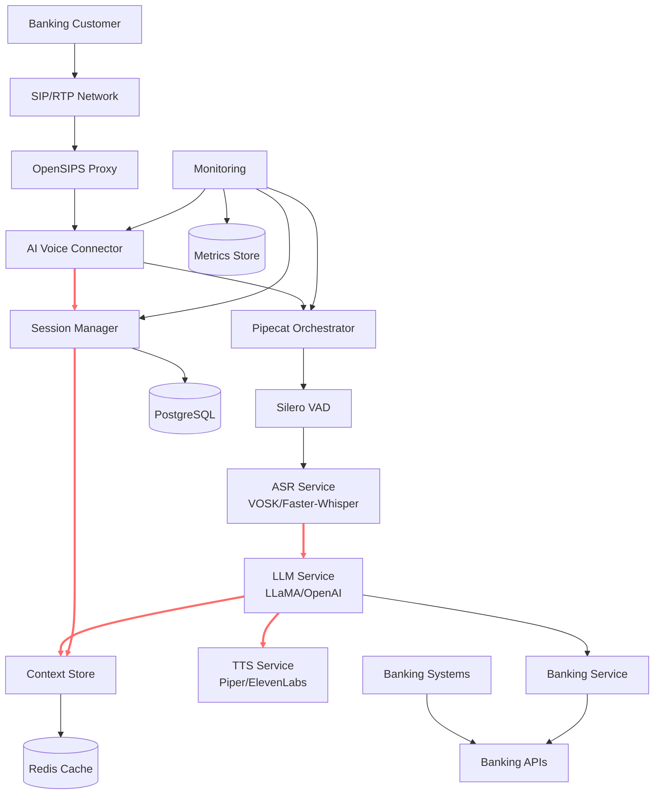
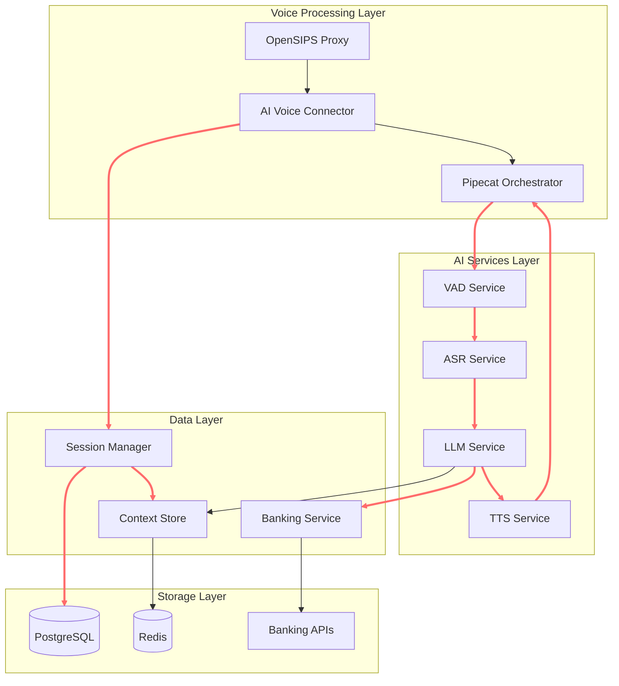
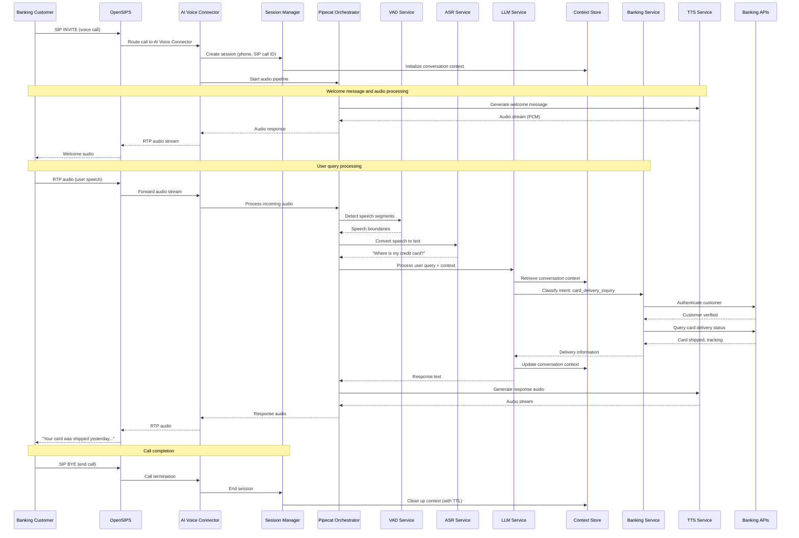

# Pipecat IVR Voice Assistant Architecture Document

## Introduction

This document outlines the overall project architecture for the Pipecat IVR Voice Assistant, including backend systems, shared services, and non-UI specific concerns. Its primary goal is to serve as the guiding architectural blueprint for AI-driven development, ensuring consistency and adherence to chosen patterns and technologies.

**Relationship to Frontend Architecture:**
This system is primarily a backend voice processing system with minimal UI requirements. Any administrative or monitoring interfaces will be addressed in a separate Frontend Architecture Document if needed. Core technology stack choices documented herein (see "Tech Stack") are definitive for the entire project.

### Starter Template or Existing Project

This is a greenfield project building on the Pipecat framework foundation. The system will be built from scratch using:

- **Pipecat** as the core audio pipeline orchestrator
- Standard Python AI/ML ecosystem components
- gRPC for service communication
- Docker containerization for deployment

No specific starter template is being used, allowing for optimal architecture design tailored to the banking voice assistant requirements.

### Change Log

| Date | Version | Description | Author |
|------|---------|-------------|---------|
| 2025-07-27 | 1.0 | Initial architecture creation from PRD | Winston (Architect) |

## High Level Architecture

### Technical Summary

The Pipecat IVR Voice Assistant employs a **microservices-within-monorepo architecture** centered around real-time audio processing pipelines. The system utilizes **gRPC for inter-service communication** and **Python-based AI/ML components** orchestrated by Pipecat. Key components include an AI Voice Connector service that bridges SIP/RTP telephony protocols with the AI pipeline, supporting both on-premise and cloud deployment scenarios. The architecture prioritizes **sub-700ms latency targets** through streaming architectures and efficient component orchestration, while maintaining **banking-grade security and reliability standards**.

### High Level Overview

**Architecture Style:** Microservices within Monorepo
- Individual services for AI Voice Connector, OpenSIPS proxy, and specialized AI pipeline components
- Unified codebase management while maintaining service boundaries
- gRPC-based service communication for type safety and performance

**Repository Structure:** Monorepo
- Centralized dependency management and tooling
- Simplified CI/CD pipeline coordination
- Shared libraries and configuration across services

**Service Architecture:** Event-driven microservices with real-time streaming
- OpenSIPS handles SIP signaling and RTP media relay
- AI Voice Connector orchestrates audio flow and session lifecycle
- Pipecat manages AI pipeline components (VAD → ASR → LLM → TTS)
- Session management service maintains conversation context

**Primary Data Flow:**
1. **Audio Ingestion:** SIP/RTP calls → OpenSIPS → AI Voice Connector
2. **Audio Processing:** PCMU/8000 → PCM conversion → Pipecat pipeline
3. **AI Processing:** VAD → ASR → LLM → TTS (with barge-in support)
4. **Audio Response:** TTS → PCM → PCMU/8000 → RTP transmission

**Key Architectural Decisions:**
- **gRPC over HTTP/REST:** For better performance and type safety in real-time scenarios
- **Dual AI Provider Support:** Local (LLaMA/Piper) and cloud (OpenAI/ElevenLabs) options
- **Containerized Deployment:** Docker orchestration for both on-premise and cloud environments
- **GPU Resource Management:** Dedicated inference services for optimal ML performance

### High Level Project Diagram



### Architectural and Design Patterns

The following architectural patterns guide the system design:

- **Event-Driven Architecture:** Audio events trigger processing pipelines with pub/sub messaging for component decoupling
  _Rationale:_ Supports real-time streaming requirements and enables horizontal scaling of AI components

- **Repository Pattern:** Abstract data access for session and context management 
  _Rationale:_ Enables testing isolation and future database migration flexibility

- **Circuit Breaker Pattern:** Fault tolerance for external API calls (banking services, cloud AI providers)
  _Rationale:_ Maintains system stability during external service outages, critical for banking reliability

- **Strategy Pattern:** Pluggable AI providers (local vs cloud for ASR, LLM, TTS)
  _Rationale:_ Allows runtime switching between cost-effective local processing and high-capability cloud services

- **Command Query Responsibility Segregation (CQRS):** Separate read/write models for session data
  _Rationale:_ Optimizes for high-frequency session updates and fast context retrieval

- **Gateway Pattern:** AI Voice Connector as unified entry point for telephony integration
  _Rationale:_ Centralizes SIP/RTP handling and provides consistent interface to AI pipeline

## Tech Stack

This section defines the DEFINITIVE technology selections for the entire project. All implementation decisions must reference these choices.

### Cloud Infrastructure

- **Provider:** Hybrid (On-premise primary, Cloud optional)
- **Key Services:** Docker orchestration, Redis clustering, PostgreSQL, GPU compute nodes
- **Deployment Regions:** On-premise banking data centers, optional AWS/Azure regions for non-sensitive workloads

### Technology Stack Table

| Category | Technology | Version | Purpose | Rationale |
|----------|------------|---------|---------|-----------|
| **Language** | Python | 3.11.7 | Primary development language | Excellent AI/ML ecosystem, Pipecat compatibility, team expertise |
| **Runtime** | Python | 3.11.7 | Application runtime | Stable LTS version, optimal AI library support |
| **Framework** | FastAPI | 0.104.1 | gRPC service framework | High performance, async support, excellent gRPC integration |
| **Orchestrator** | Pipecat | Latest | Audio pipeline orchestration | Purpose-built for real-time audio AI pipelines |
| **Communication** | gRPC | 1.60.0 | Inter-service communication | Type safety, performance, streaming support |
| **SIP Proxy** | OpenSIPS | 3.4.x | SIP signaling and routing | Industry standard, proven banking deployments |
| **Audio Processing** | PyAudio | 0.2.13 | Audio I/O handling | Low-latency audio streaming |
| **VAD** | Silero VAD | Latest | Voice activity detection | Optimal accuracy/speed tradeoff |
| **ASR Local** | VOSK | 0.3.45 | CPU-based speech recognition | Cost-effective, offline capability |
| **ASR Cloud** | Faster-Whisper | 0.10.0 | GPU-based speech recognition | Higher accuracy for complex queries |
| **LLM Local** | LLaMA.cpp | Latest | On-premise language model | Privacy compliance, cost control |
| **LLM Cloud** | OpenAI API | GPT-4o | Cloud language model | Superior reasoning capabilities |
| **TTS Local** | Piper | 1.2.0 | CPU-based speech synthesis | Offline capability, consistent quality |
| **TTS Cloud** | ElevenLabs API | Latest | Cloud speech synthesis | Premium voice quality |
| **Database** | PostgreSQL | 15.5 | Session and configuration data | ACID compliance, banking standards |
| **Cache** | Redis | 7.2.3 | Session context and caching | High-performance, conversation state |
| **Monitoring** | Prometheus | 2.48.0 | Metrics collection | Industry standard, excellent alerting |
| **Logging** | Structured logging | Python stdlib | Application logging | JSON format, correlation IDs |
| **Containerization** | Docker | 24.0.7 | Application packaging | Consistent deployment across environments |
| **Orchestration** | Docker Compose | 2.23.0 | Local development | Simple multi-service orchestration |
| **Production Orchestration** | Kubernetes | 1.28.x | Production deployment | Scalability, high availability |
| **Testing** | pytest | 7.4.3 | Unit and integration testing | Comprehensive testing framework |
| **API Documentation** | gRPC reflection | Built-in | Service discovery | Dynamic API documentation |
| **Security** | TLS 1.3 | Latest | Transport encryption | Banking security standards |

## Data Models

The core data models represent the essential entities for session management, conversation context, and banking integration.

### CallSession

**Purpose:** Manages the lifecycle and metadata of individual voice calls

**Key Attributes:**
- session_id: UUID - Unique identifier for correlation across services
- caller_phone: string - Originating phone number
- call_start_time: timestamp - Session initiation time
- call_end_time: timestamp - Session termination time (nullable)
- sip_call_id: string - OpenSIPS call identifier
- status: enum - ACTIVE, COMPLETED, FAILED, INTERRUPTED
- ai_provider_config: JSON - Selected AI providers for this session

**Relationships:**
- One-to-many with ConversationContext
- One-to-many with BankingTransaction

### ConversationContext

**Purpose:** Stores conversation memory and AI processing state for context-aware responses

**Key Attributes:**
- context_id: UUID - Unique context identifier
- session_id: UUID - Foreign key to CallSession
- conversation_history: JSON - Array of message exchanges
- current_intent: string - Detected user intent (e.g., "card_delivery_inquiry")
- customer_data: JSON - Cached customer information for session
- last_updated: timestamp - Context modification time
- expires_at: timestamp - TTL for context cleanup

**Relationships:**
- Many-to-one with CallSession
- References customer data from banking systems

### BankingTransaction

**Purpose:** Tracks banking-specific operations and customer authentication within voice sessions

**Key Attributes:**
- transaction_id: UUID - Unique transaction identifier
- session_id: UUID - Foreign key to CallSession
- customer_id: string - Banking system customer identifier
- transaction_type: enum - CARD_INQUIRY, BALANCE_CHECK, etc.
- authentication_status: enum - PENDING, VERIFIED, FAILED
- query_parameters: JSON - Structured query data
- response_data: JSON - Banking system response
- created_at: timestamp - Transaction initiation time

**Relationships:**
- Many-to-one with CallSession
- References external banking system entities

## Components

The system architecture is composed of specialized microservices, each with clearly defined responsibilities and interfaces.

### AI Voice Connector

**Responsibility:** Central orchestrator that bridges SIP/RTP telephony with the AI processing pipeline, managing call lifecycle and audio stream coordination.

**Key Interfaces:**
- gRPC service for session management and call control
- RTP audio stream ingestion and transmission
- Pipecat pipeline integration for audio processing
- OpenSIPS integration for SIP signaling

**Dependencies:** 
- OpenSIPS for SIP/RTP handling
- Pipecat Orchestrator for AI pipeline
- Session Manager for call state
- Audio codec libraries for PCMU/PCM conversion

**Technology Stack:** Python 3.11, FastAPI with gRPC, PyAudio, asyncio for real-time processing

### Pipecat Orchestrator

**Responsibility:** Manages the AI processing pipeline workflow, coordinating VAD, ASR, LLM, and TTS components with real-time streaming and barge-in support.

**Key Interfaces:**
- Pipecat framework API for pipeline configuration
- Audio stream processing with VAD integration
- gRPC clients for AI service communication
- Event-driven pipeline state management

**Dependencies:**
- VAD Service for speech detection
- ASR Service for speech-to-text
- LLM Service for language processing
- TTS Service for speech synthesis

**Technology Stack:** Python 3.11, Pipecat framework, asyncio, streaming audio protocols

### VAD Service

**Responsibility:** Real-time voice activity detection using Silero VAD to identify speech segments and silence periods for accurate audio processing.

**Key Interfaces:**
- gRPC service for VAD processing requests
- Audio chunk streaming input/output
- Configurable detection thresholds
- Real-time processing status reporting

**Dependencies:**
- Silero VAD model and inference engine
- Audio preprocessing utilities

**Technology Stack:** Python 3.11, Silero VAD, PyTorch, gRPC server

### ASR Service

**Responsibility:** Speech-to-text conversion with dual provider support (VOSK for local/cost-effective and Faster-Whisper for cloud/high-accuracy processing).

**Key Interfaces:**
- gRPC service with streaming audio input
- Token-level streaming output for low latency
- Provider selection API (VOSK vs Faster-Whisper)
- Confidence scoring and error handling

**Dependencies:**
- VOSK models for local processing
- Faster-Whisper for GPU acceleration
- Audio format conversion utilities

**Technology Stack:** Python 3.11, VOSK, Faster-Whisper, gRPC, CUDA (optional)

### LLM Service

**Responsibility:** Natural language understanding and response generation with support for both local LLaMA and cloud OpenAI providers, including banking-specific intent handling.

**Key Interfaces:**
- gRPC service for text processing
- Streaming token output for real-time responses
- Context-aware conversation management
- Banking intent classification and routing

**Dependencies:**
- LLaMA.cpp for local inference
- OpenAI API client for cloud processing
- Context Store for conversation memory
- Banking Service for domain-specific queries

**Technology Stack:** Python 3.11, LLaMA.cpp, OpenAI SDK, gRPC, GPU support

### TTS Service

**Responsibility:** Text-to-speech synthesis with dual provider support (Piper for local/consistent and ElevenLabs for cloud/premium quality).

**Key Interfaces:**
- gRPC service for text-to-audio conversion
- Streaming audio output for low latency
- Voice configuration and selection
- Audio format specification (PCM output)

**Dependencies:**
- Piper TTS models for local synthesis
- ElevenLabs API for cloud synthesis
- Audio encoding/format conversion

**Technology Stack:** Python 3.11, Piper TTS, ElevenLabs API, gRPC

### Session Manager

**Responsibility:** Manages call session lifecycle, state persistence, and coordination between all voice processing components.

**Key Interfaces:**
- gRPC service for session CRUD operations
- Real-time session state updates
- Call event notification and logging
- Session cleanup and timeout handling

**Dependencies:**
- PostgreSQL for persistent session storage
- Redis for session state caching
- Context Store for conversation data

**Technology Stack:** Python 3.11, FastAPI with gRPC, PostgreSQL, Redis, SQLAlchemy

### Context Store

**Responsibility:** High-performance storage and retrieval of conversation context, customer data caching, and memory management for multi-turn conversations.

**Key Interfaces:**
- gRPC service for context operations
- Real-time context updates and retrieval
- TTL-based automatic cleanup
- Context search and filtering

**Dependencies:**
- Redis for high-speed context caching
- PostgreSQL for persistent context history

**Technology Stack:** Python 3.11, Redis, gRPC, JSON serialization

### Banking Service

**Responsibility:** Integration layer for banking system APIs, handling customer authentication, card delivery inquiries, and other banking-specific operations.

**Key Interfaces:**
- gRPC service for banking operations
- Customer authentication and verification
- Card delivery status queries
- Secure banking API integration

**Dependencies:**
- Banking system APIs (external)
- Customer data validation services
- Security and compliance middleware

**Technology Stack:** Python 3.11, gRPC, HTTP clients for banking APIs, security libraries

### Component Diagrams



## Core Workflows

The following sequence diagrams illustrate critical system workflows for voice call processing and banking integration.

### Card Delivery Inquiry Workflow



### Barge-in Interruption Workflow

```mermaid
sequenceDiagram
    participant C as Banking Customer
    participant AVC as AI Voice Connector
    participant P as Pipecat Orchestrator
    participant VAD as VAD Service
    participant ASR as ASR Service
    participant TTS as TTS Service
    
    Note over C,TTS: System is speaking
    TTS->>P: Streaming TTS audio
    P->>AVC: Outbound audio stream
    
    parallel
        P->>VAD: Monitor for speech during TTS
    and
        C->>AVC: User interruption (RTP audio)
        AVC->>P: Incoming audio stream
        P->>VAD: Process interruption audio
        VAD->>P: Speech detected (confidence > threshold)
    end
    
    P->>TTS: STOP current synthesis
    TTS-->>P: Synthesis halted
    P->>ASR: Process interruption speech
    ASR-->>P: "Wait, I have a question"
    
    Note over P: Context preserved, ready for new query
    P->>VAD: Reset for new speech detection
```

## gRPC API Specifications

The system uses gRPC for all inter-service communication, providing type safety and high performance.

```yaml
# Core gRPC service definitions for the voice assistant system

# AI Voice Connector Service
service AIVoiceConnectorService:
  rpc CreateSession(CreateSessionRequest) returns (SessionResponse)
  rpc ProcessAudioStream(stream AudioChunk) returns (stream AudioChunk)
  rpc EndSession(EndSessionRequest) returns (SessionResponse)
  rpc GetSessionStatus(SessionStatusRequest) returns (SessionStatusResponse)

# Session Manager Service  
service SessionManagerService:
  rpc CreateSession(CallSession) returns (SessionResponse)
  rpc UpdateSession(UpdateSessionRequest) returns (SessionResponse)
  rpc GetSession(GetSessionRequest) returns (CallSession)
  rpc EndSession(EndSessionRequest) returns (SessionResponse)

# AI Pipeline Services
service VADService:
  rpc ProcessAudio(stream AudioChunk) returns (stream VADResult)
  rpc Configure(VADConfiguration) returns (ConfigurationResponse)

service ASRService:
  rpc RecognizeSpeech(stream AudioChunk) returns (stream RecognitionResult)
  rpc SelectProvider(ProviderSelectionRequest) returns (ConfigurationResponse)

service LLMService:
  rpc ProcessText(TextProcessingRequest) returns (stream TextResponse)
  rpc UpdateContext(ContextUpdateRequest) returns (ContextResponse)

service TTSService:
  rpc SynthesizeText(TextSynthesisRequest) returns (stream AudioChunk)
  rpc SelectVoice(VoiceSelectionRequest) returns (ConfigurationResponse)

# Context and Banking Services
service ContextStoreService:
  rpc GetContext(ContextRequest) returns (ConversationContext)
  rpc UpdateContext(ContextUpdateRequest) returns (ContextResponse)
  rpc CleanupContext(CleanupRequest) returns (CleanupResponse)

service BankingService:
  rpc AuthenticateCustomer(AuthenticationRequest) returns (AuthenticationResponse)
  rpc QueryCardDelivery(CardDeliveryRequest) returns (CardDeliveryResponse)
  rpc ProcessTransaction(TransactionRequest) returns (TransactionResponse)

# Common message types
message AudioChunk:
  bytes audio_data = 1
  int32 sample_rate = 2
  string format = 3
  int64 timestamp = 4

message SessionResponse:
  string session_id = 1
  SessionStatus status = 2
  string message = 3

message TextProcessingRequest:
  string text = 1
  string session_id = 2
  ConversationContext context = 3
  string intent = 4
```

## Database Schema

The system uses PostgreSQL for persistent data and Redis for high-performance caching.

### PostgreSQL Schema

```sql
-- Call sessions table
CREATE TABLE call_sessions (
    session_id UUID PRIMARY KEY DEFAULT gen_random_uuid(),
    caller_phone VARCHAR(20) NOT NULL,
    call_start_time TIMESTAMP WITH TIME ZONE NOT NULL DEFAULT NOW(),
    call_end_time TIMESTAMP WITH TIME ZONE,
    sip_call_id VARCHAR(255) NOT NULL,
    status VARCHAR(20) NOT NULL CHECK (status IN ('ACTIVE', 'COMPLETED', 'FAILED', 'INTERRUPTED')),
    ai_provider_config JSONB,
    created_at TIMESTAMP WITH TIME ZONE NOT NULL DEFAULT NOW(),
    updated_at TIMESTAMP WITH TIME ZONE NOT NULL DEFAULT NOW()
);

-- Conversation context history
CREATE TABLE conversation_contexts (
    context_id UUID PRIMARY KEY DEFAULT gen_random_uuid(),
    session_id UUID NOT NULL REFERENCES call_sessions(session_id) ON DELETE CASCADE,
    conversation_history JSONB NOT NULL DEFAULT '[]',
    current_intent VARCHAR(100),
    customer_data JSONB,
    last_updated TIMESTAMP WITH TIME ZONE NOT NULL DEFAULT NOW(),
    expires_at TIMESTAMP WITH TIME ZONE NOT NULL
);

-- Banking transactions
CREATE TABLE banking_transactions (
    transaction_id UUID PRIMARY KEY DEFAULT gen_random_uuid(),
    session_id UUID NOT NULL REFERENCES call_sessions(session_id) ON DELETE CASCADE,
    customer_id VARCHAR(100),
    transaction_type VARCHAR(50) NOT NULL,
    authentication_status VARCHAR(20) NOT NULL CHECK (authentication_status IN ('PENDING', 'VERIFIED', 'FAILED')),
    query_parameters JSONB,
    response_data JSONB,
    created_at TIMESTAMP WITH TIME ZONE NOT NULL DEFAULT NOW()
);

-- Indexes for performance
CREATE INDEX idx_call_sessions_status ON call_sessions(status);
CREATE INDEX idx_call_sessions_start_time ON call_sessions(call_start_time);
CREATE INDEX idx_conversation_contexts_session_id ON conversation_contexts(session_id);
CREATE INDEX idx_conversation_contexts_expires_at ON conversation_contexts(expires_at);
CREATE INDEX idx_banking_transactions_session_id ON banking_transactions(session_id);
CREATE INDEX idx_banking_transactions_customer_id ON banking_transactions(customer_id);

-- Auto-update timestamps
CREATE OR REPLACE FUNCTION update_updated_at_column()
RETURNS TRIGGER AS $$
BEGIN
    NEW.updated_at = NOW();
    RETURN NEW;
END;
$$ language 'plpgsql';

CREATE TRIGGER update_call_sessions_updated_at 
    BEFORE UPDATE ON call_sessions 
    FOR EACH ROW EXECUTE FUNCTION update_updated_at_column();
```

### Redis Cache Structure

```yaml
# Session state caching (TTL: 1 hour)
session:{session_id}:
  caller_phone: string
  status: string
  ai_providers: object
  call_metadata: object

# Conversation context (TTL: 30 minutes)
context:{session_id}:
  history: array
  current_intent: string
  customer_data: object
  last_interaction: timestamp

# Active call routing (TTL: 2 hours)
call_routing:{sip_call_id}:
  session_id: string
  avc_instance: string
  pipeline_config: object
```

## Source Tree

```plaintext
opensips-ai-voice-connector/
├── services/                           # Microservices
│   ├── ai-voice-connector/             # Main orchestrator service
│   │   ├── src/
│   │   │   ├── main.py                 # FastAPI + gRPC server
│   │   │   ├── audio/                  # Audio processing
│   │   │   │   ├── codecs.py           # PCMU/PCM conversion
│   │   │   │   └── streaming.py        # RTP handling
│   │   │   ├── grpc_services/          # gRPC service implementations
│   │   │   └── opensips/               # OpenSIPS integration
│   │   ├── proto/                      # gRPC protocol definitions
│   │   ├── tests/
│   │   ├── Dockerfile
│   │   └── requirements.txt
│   ├── pipecat-orchestrator/           # Pipecat pipeline manager
│   │   ├── src/
│   │   │   ├── main.py                 # Pipecat application
│   │   │   ├── pipeline/               # Pipeline configuration
│   │   │   ├── providers/              # AI provider adapters
│   │   │   └── interruption/           # Barge-in handling
│   │   └── requirements.txt
│   ├── vad-service/                    # Voice Activity Detection
│   │   ├── src/
│   │   │   ├── main.py                 # gRPC service
│   │   │   ├── silero/                 # Silero VAD integration
│   │   │   └── models/                 # VAD model management
│   │   └── requirements.txt
│   ├── asr-service/                    # Automatic Speech Recognition
│   │   ├── src/
│   │   │   ├── main.py                 # gRPC service
│   │   │   ├── providers/              # VOSK & Faster-Whisper
│   │   │   └── streaming/              # Token streaming
│   │   └── requirements.txt
│   ├── llm-service/                    # Language Model Processing
│   │   ├── src/
│   │   │   ├── main.py                 # gRPC service
│   │   │   ├── providers/              # LLaMA & OpenAI
│   │   │   ├── banking/                # Banking intent handling
│   │   │   └── context/                # Context management
│   │   └── requirements.txt
│   ├── tts-service/                    # Text-to-Speech
│   │   ├── src/
│   │   │   ├── main.py                 # gRPC service
│   │   │   ├── providers/              # Piper & ElevenLabs
│   │   │   └── voices/                 # Voice configuration
│   │   └── requirements.txt
│   ├── session-manager/                # Session lifecycle management
│   │   ├── src/
│   │   │   ├── main.py                 # gRPC service
│   │   │   ├── database/               # PostgreSQL models
│   │   │   ├── cache/                  # Redis operations
│   │   │   └── models/                 # Data models
│   │   └── requirements.txt
│   ├── context-store/                  # Conversation context
│   │   ├── src/
│   │   │   ├── main.py                 # gRPC service
│   │   │   ├── redis/                  # Redis operations
│   │   │   └── cleanup/                # TTL management
│   │   └── requirements.txt
│   └── banking-service/                # Banking system integration
│       ├── src/
│       │   ├── main.py                 # gRPC service
│       │   ├── apis/                   # Banking API clients
│       │   ├── auth/                   # Customer authentication
│       │   └── intents/                # Banking intent handlers
│       └── requirements.txt
├── shared/                             # Shared libraries
│   ├── proto/                          # Common gRPC definitions
│   ├── models/                         # Shared data models
│   ├── utils/                          # Common utilities
│   └── testing/                        # Test utilities
├── infrastructure/                     # Deployment and infrastructure
│   ├── docker/                         # Docker configurations
│   │   ├── docker-compose.dev.yml      # Development environment
│   │   ├── docker-compose.prod.yml     # Production environment
│   │   └── Dockerfile.base             # Base Python image
│   ├── opensips/                       # OpenSIPS configuration
│   │   ├── opensips.cfg                # Main configuration
│   │   └── scripts/                    # SIP routing scripts
│   ├── kubernetes/                     # K8s manifests
│   │   ├── services/                   # Service definitions
│   │   ├── deployments/                # Deployment configs
│   │   └── monitoring/                 # Prometheus/Grafana
│   └── monitoring/                     # Observability
│       ├── prometheus/                 # Metrics collection
│       ├── grafana/                    # Dashboards
│       └── logging/                    # Structured logging
├── scripts/                            # Development and deployment scripts
│   ├── dev-setup.sh                    # Development environment setup
│   ├── proto-gen.sh                    # gRPC code generation
│   ├── test-all.sh                     # Run all tests
│   └── deploy.sh                       # Deployment script
├── docs/                               # Documentation
│   ├── architecture.md                 # This document
│   ├── prd.md                          # Product requirements
│   ├── api/                            # API documentation
│   └── deployment/                     # Deployment guides
├── tests/                              # Integration and system tests
│   ├── integration/                    # Service integration tests
│   ├── performance/                    # Load and latency tests
│   └── e2e/                            # End-to-end scenarios
├── .github/                            # CI/CD workflows
│   └── workflows/                      # GitHub Actions
├── pyproject.toml                      # Python project configuration
├── docker-compose.yml                  # Default development setup
└── README.md                           # Project overview
```

## Infrastructure and Deployment

### Infrastructure as Code

- **Tool:** Docker Compose 2.23.0 for development, Kubernetes 1.28.x for production
- **Location:** `infrastructure/docker/` and `infrastructure/kubernetes/`
- **Approach:** GitOps with declarative configurations for reproducible deployments

### Deployment Strategy

- **Strategy:** Blue-green deployment for zero-downtime updates
- **CI/CD Platform:** GitHub Actions with automated testing and deployment
- **Pipeline Configuration:** `.github/workflows/deploy.yml`

### Environments

- **Development:** Local Docker Compose with hot-reload and debugging
- **Staging:** Kubernetes cluster with production-like configuration for testing
- **Production:** High-availability Kubernetes with auto-scaling and monitoring

### Environment Promotion Flow

```text
Development (Docker Compose) → Staging (K8s) → Production (K8s)
- Automated testing at each stage
- Manual approval required for production
- Automated rollback on health check failures
```

### Rollback Strategy

- **Primary Method:** Kubernetes rolling update rollback with previous image versions
- **Trigger Conditions:** Health check failures, latency threshold breaches, error rate spikes
- **Recovery Time Objective:** < 5 minutes for automatic rollback

## Error Handling Strategy

### General Approach

- **Error Model:** Structured exceptions with correlation IDs for tracing
- **Exception Hierarchy:** Custom banking exceptions, AI processing errors, network failures
- **Error Propagation:** gRPC status codes with detailed error messages

### Logging Standards

- **Library:** Python stdlib logging with structured JSON format
- **Format:** `{"timestamp": "ISO8601", "level": "INFO", "correlation_id": "uuid", "service": "service-name", "message": "log message"}`
- **Levels:** DEBUG, INFO, WARNING, ERROR, CRITICAL with appropriate usage
- **Required Context:**
  - Correlation ID: UUID per request for distributed tracing
  - Service Context: Service name, version, instance ID
  - User Context: Session ID, call ID (no PII in logs)

### Error Handling Patterns

#### External API Errors
- **Retry Policy:** Exponential backoff with jitter, max 3 retries
- **Circuit Breaker:** Open after 5 consecutive failures, half-open after 30s
- **Timeout Configuration:** 5s for banking APIs, 10s for cloud AI services
- **Error Translation:** Map external error codes to internal error types

#### Business Logic Errors
- **Custom Exceptions:** BankingError, AuthenticationError, IntentNotFoundError
- **User-Facing Errors:** Friendly messages without technical details
- **Error Codes:** Structured error codes for client error handling

#### Data Consistency
- **Transaction Strategy:** Database transactions for session state changes
- **Compensation Logic:** Cleanup procedures for failed AI processing
- **Idempotency:** UUID-based idempotent operations for critical flows

## Security

### Input Validation
- **Validation Library:** Pydantic for data validation and serialization
- **Validation Location:** At gRPC service boundaries before processing
- **Required Rules:**
  - All external inputs MUST be validated against schemas
  - Audio input size limits (max 1MB per chunk)
  - Text input sanitization for prompt injection prevention

### Authentication & Authorization
- **Auth Method:** TLS client certificates for inter-service communication
- **Session Management:** JWT tokens for API access with short TTL
- **Required Patterns:**
  - mTLS for all gRPC communication
  - Customer authentication through banking system integration

### Secrets Management
- **Development:** Environment variables with `.env` files (not committed)
- **Production:** Kubernetes secrets with external secret management
- **Code Requirements:**
  - NEVER hardcode secrets or API keys
  - Access via configuration service only
  - No secrets in logs or error messages

### API Security
- **Rate Limiting:** Token bucket algorithm, 100 requests/minute per client
- **CORS Policy:** Restricted to authorized domains only
- **Security Headers:** HSTS, CSP, X-Frame-Options for any HTTP endpoints
- **HTTPS Enforcement:** TLS 1.3 minimum for all external communication

### Data Protection
- **Encryption at Rest:** AES-256 for database encryption
- **Encryption in Transit:** TLS 1.3 for all network communication
- **PII Handling:** No customer PII stored in logs or metrics
- **Logging Restrictions:** Exclude audio data, customer details, authentication tokens

## Coding Standards

### Core Standards
- **Languages & Runtimes:** Python 3.11.7 with type hints mandatory
- **Style & Linting:** Black formatter, Ruff linter, mypy type checking
- **Test Organization:** `tests/` directory parallel to `src/`, pytest framework

### Critical Rules
- **Logging:** Never use `print()` in production code - use structured logger
- **gRPC Responses:** All gRPC responses must include correlation IDs
- **Error Handling:** Catch specific exceptions, never bare `except:`
- **Audio Processing:** Always specify audio format and sample rate explicitly
- **Context Management:** Use async context managers for resource cleanup

## Test Strategy and Standards

### Testing Philosophy
- **Approach:** Test-driven development for critical components
- **Coverage Goals:** 90% line coverage for business logic, 80% overall
- **Test Pyramid:** 70% unit, 20% integration, 10% end-to-end

### Test Types and Organization

#### Unit Tests
- **Framework:** pytest 7.4.3 with asyncio support
- **File Convention:** `test_*.py` files parallel to source code
- **Location:** Each service has its own `tests/` directory
- **Mocking Library:** pytest-mock for dependency mocking
- **Coverage Requirement:** 90% for services, 80% for utilities

#### Integration Tests
- **Scope:** Service-to-service communication via gRPC
- **Location:** `tests/integration/` in project root
- **Test Infrastructure:**
  - **PostgreSQL:** Testcontainers for isolated database testing
  - **Redis:** Redis container for cache testing
  - **gRPC Services:** In-process servers for fast testing

#### End-to-End Tests
- **Framework:** pytest with custom voice assistant test utilities
- **Scope:** Complete voice call scenarios using SIP test clients
- **Environment:** Dedicated test environment with all services deployed
- **Test Data:** Synthetic audio files and mock banking responses

### Test Data Management
- **Strategy:** Factory pattern for test data generation
- **Fixtures:** Shared fixtures in `shared/testing/` for common data
- **Factories:** Audio sample factories, session factories, banking data factories
- **Cleanup:** Automatic cleanup after each test with proper resource disposal

## Next Steps

This architecture document provides the foundation for implementing the Pipecat IVR Voice Assistant. The next phase involves:

1. **Development Team Setup:**
   - Use this document as the definitive technical reference
   - Begin with Epic 1 implementation (Foundation & Core Infrastructure)
   - Set up development environment using provided Docker Compose configuration

2. **Infrastructure Setup:**
   - Deploy development environment using `infrastructure/docker/`
   - Configure OpenSIPS with provided configuration templates
   - Set up monitoring and observability stack

3. **Service Implementation:**
   - Start with Session Manager and Context Store services
   - Implement AI Voice Connector as the central orchestrator
   - Add AI pipeline services following the component specifications

This architecture ensures scalable, maintainable, and secure implementation of the banking voice assistant system.