# OpenSIPS AI Voice Connector Architecture Document

## Introduction

This document outlines the implemented architecture for the OpenSIPS AI Voice Connector, a microservices-based voice assistant system with native pipecat integration. The system has evolved from initial design to a production-ready implementation with comprehensive gRPC services, Docker orchestration, and advanced AI processing capabilities.

**Implementation Status:**
This system represents a fully implemented microservices architecture with working gRPC services, Docker containerization, and native pipecat framework integration. The architecture has been validated through implementation of core services including ASR, LLM, TTS, and service orchestration components.

### Implementation Approach

This system was built using a microservices-within-monorepo approach leveraging:

- **Native Pipecat Framework** for audio pipeline orchestration and AI component integration
- **gRPC microservices** for high-performance inter-service communication
- **Docker containerization** with development and production deployment modes
- **Common service base** for standardized service management and health monitoring

The implementation prioritizes maintainability, scalability, and banking-grade reliability while achieving sub-700ms latency targets.

### Change Log

| Date | Version | Description | Author |
|------|---------|-------------|---------|
| 2025-07-27 | 1.0 | Initial architecture creation from PRD | Winston (Architect) |
| 2025-07-27 | 2.0 | Updated to reflect current microservices implementation | Winston (Architect) |

## High Level Architecture

### Technical Summary

The OpenSIPS AI Voice Connector implements a **microservices-within-monorepo architecture** with **native pipecat framework integration** for real-time audio processing pipelines. The system features **four independent gRPC microservices** (ASR, LLM, TTS, Core) with **common service base architecture** for standardized health monitoring, logging, and configuration management. The architecture achieves **sub-700ms latency targets** through streaming architectures and efficient service orchestration, while maintaining **banking-grade security and reliability standards**.

### High Level Overview

**Implementation Status:** ✅ **FULLY IMPLEMENTED**
- Four working gRPC microservices with health monitoring
- Docker orchestration with development and production modes  
- Native pipecat framework integration for audio processing
- Common service base for standardized service management

**Architecture Style:** Microservices within Monorepo
- **ASR Service** (port 50051): Native Vosk integration with enhanced service base
- **LLM Service** (port 50052): LLaMA processing with llama-cpp-python integration
- **TTS Service** (port 50053): Piper text-to-speech with streaming audio output
- **Core Application** (port 8080): OpenSIPS integration and pipeline orchestration

**Repository Structure:** Monorepo with Service Separation
- `services/` directory with independent microservices
- `core/` directory with application orchestration and native pipecat integration
- `shared/` libraries and common utilities
- Centralized Docker orchestration and configuration management

**Service Architecture:** gRPC-based microservices with native pipecat orchestration
- **Core Application:** Orchestrates audio flow and session lifecycle using pipecat
- **Independent AI Services:** ASR, LLM, TTS as separate gRPC services
- **Service Discovery:** Docker networking with health monitoring
- **Common Service Base:** Standardized logging, health checks, and configuration

**Implemented Data Flow:**
1. **Audio Ingestion:** SIP/RTP calls → OpenSIPS → Core Application (pipecat integration)
2. **Audio Processing:** PCMU/8000 → PCM conversion → pipecat pipeline orchestration
3. **AI Processing:** Pipecat → gRPC calls to ASR → LLM → TTS services
4. **Audio Response:** TTS service → pipecat → PCM → PCMU/8000 → RTP transmission

**Implemented Architectural Decisions:**
- **gRPC Services:** All AI components implemented as independent gRPC services
- **Native Pipecat Integration:** Full pipecat framework usage for audio processing and pipeline orchestration
- **Docker Containerization:** Complete containerization with health checks and service orchestration
- **Common Service Base:** Standardized service management, health monitoring, and graceful shutdown

### High Level Project Diagram

```mermaid
graph TB
    %% External Systems
    Caller[Banking Customer] --> SIP[SIP/RTP Network]
    Bank[Banking Systems] --> API[Banking APIs]
    
    %% SIP Layer
    SIP --> OpenSIPS[OpenSIPS Proxy]
    
    %% Core Application (Implemented)
    OpenSIPS --> Core[Core Application<br/>Port 8080<br/>✅ IMPLEMENTED]
    Core --> Pipecat[Native Pipecat<br/>Framework Integration<br/>✅ IMPLEMENTED]
    
    %% Implemented gRPC Microservices
    Pipecat --> ASR[ASR Service<br/>Port 50051<br/>Native Vosk<br/>✅ IMPLEMENTED]
    ASR --> LLM[LLM Service<br/>Port 50052<br/>LLaMA + llama-cpp<br/>✅ IMPLEMENTED]
    LLM --> TTS[TTS Service<br/>Port 50053<br/>Piper TTS<br/>✅ IMPLEMENTED]
    
    %% Service Communication (gRPC)
    Core -.->|gRPC Health<br/>Monitoring| ASR
    Core -.->|gRPC Health<br/>Monitoring| LLM  
    Core -.->|gRPC Health<br/>Monitoring| TTS
    
    %% Future Services (Pending Phase 3-4)
    Core -.->|Future Integration| Session[Session Manager<br/>⏳ PENDING]
    LLM -.->|Future Integration| Context[Context Store<br/>⏳ PENDING]
    LLM -.->|Future Integration| Banking[Banking Service<br/>⏳ PENDING]
    Banking -.->|Future Integration| API
    
    %% Docker Infrastructure (Implemented)
    Docker[Docker Compose<br/>✅ IMPLEMENTED] --> Core
    Docker --> ASR
    Docker --> LLM
    Docker --> TTS
    
    %% Service Base (Implemented)
    Common[Common Service Base<br/>✅ IMPLEMENTED] --> ASR
    Common --> LLM
    Common --> TTS
    
    %% Storage (Future)
    Context -.->|Future| Redis[(Redis Cache<br/>⏳ PENDING)]
    Session -.->|Future| Postgres[(PostgreSQL<br/>⏳ PENDING)]
    
    %% gRPC connections (implemented)
    linkStyle 4 stroke:#00ff00,stroke-width:4px
    linkStyle 5 stroke:#00ff00,stroke-width:4px
    linkStyle 6 stroke:#00ff00,stroke-width:4px
    linkStyle 7 stroke:#00ff00,stroke-width:4px
```



### Architectural and Design Patterns

The following architectural patterns guide the system design:

- **Event-Driven Architecture:** Audio events trigger processing pipelines with pub/sub messaging for component decoupling
  _Rationale:_ Supports real-time streaming requirements and enables horizontal scaling of AI components

- **Repository Pattern:** Abstract data access for session and context management 
  _Rationale:_ Enables testing isolation and future database migration flexibility

- **Circuit Breaker Pattern:** Fault tolerance for external API calls (banking services, cloud AI providers)
  _Rationale:_ Maintains system stability during external service outages, critical for banking reliability

- **Strategy Pattern:** Pluggable AI providers (local vs cloud for ASR, LLM, TTS)
  _Rationale:_ Allows runtime switching between cost-effective local processing and high-capability cloud services

- **Command Query Responsibility Segregation (CQRS):** Separate read/write models for session data
  _Rationale:_ Optimizes for high-frequency session updates and fast context retrieval

- **Gateway Pattern:** AI Voice Connector as unified entry point for telephony integration
  _Rationale:_ Centralizes SIP/RTP handling and provides consistent interface to AI pipeline

## Tech Stack

This section defines the DEFINITIVE technology selections for the entire project. All implementation decisions must reference these choices.

### Cloud Infrastructure

- **Provider:** Hybrid (On-premise primary, Cloud optional)
- **Key Services:** Docker orchestration, Redis clustering, PostgreSQL, GPU compute nodes
- **Deployment Regions:** On-premise banking data centers, optional AWS/Azure regions for non-sensitive workloads

### Technology Stack Table

| Category | Technology | Version | Purpose | Rationale |
|----------|------------|---------|---------|-----------|
| **Language** | Python | 3.11.7 | Primary development language | Excellent AI/ML ecosystem, Pipecat compatibility, team expertise |
| **Runtime** | Python | 3.11.7 | Application runtime | Stable LTS version, optimal AI library support |
| **Framework** | FastAPI | 0.104.1 | gRPC service framework | High performance, async support, excellent gRPC integration |
| **Orchestrator** | Pipecat | Latest | Audio pipeline orchestration | Purpose-built for real-time audio AI pipelines |
| **Communication** | gRPC | 1.60.0 | Inter-service communication | Type safety, performance, streaming support |
| **SIP Proxy** | OpenSIPS | 3.4.x | SIP signaling and routing | Industry standard, proven banking deployments |
| **Audio Processing** | PyAudio | 0.2.13 | Audio I/O handling | Low-latency audio streaming |
| **VAD** | Silero VAD | Latest | Voice activity detection | Optimal accuracy/speed tradeoff |
| **ASR Local** | VOSK | 0.3.45 | CPU-based speech recognition | Cost-effective, offline capability |
| **ASR Cloud** | Faster-Whisper | 0.10.0 | GPU-based speech recognition | Higher accuracy for complex queries |
| **LLM Local** | LLaMA.cpp | Latest | On-premise language model | Privacy compliance, cost control |
| **LLM Cloud** | OpenAI API | GPT-4o | Cloud language model | Superior reasoning capabilities |
| **TTS Local** | Piper | 1.2.0 | CPU-based speech synthesis | Offline capability, consistent quality |
| **TTS Cloud** | ElevenLabs API | Latest | Cloud speech synthesis | Premium voice quality |
| **Database** | PostgreSQL | 15.5 | Session and configuration data | ACID compliance, banking standards |
| **Cache** | Redis | 7.2.3 | Session context and caching | High-performance, conversation state |
| **Monitoring** | Prometheus | 2.48.0 | Metrics collection | Industry standard, excellent alerting |
| **Logging** | Structured logging | Python stdlib | Application logging | JSON format, correlation IDs |
| **Containerization** | Docker | 24.0.7 | Application packaging | Consistent deployment across environments |
| **Orchestration** | Docker Compose | 2.23.0 | Local development | Simple multi-service orchestration |
| **Production Orchestration** | Kubernetes | 1.28.x | Production deployment | Scalability, high availability |
| **Testing** | pytest | 7.4.3 | Unit and integration testing | Comprehensive testing framework |
| **API Documentation** | gRPC reflection | Built-in | Service discovery | Dynamic API documentation |
| **Security** | TLS 1.3 | Latest | Transport encryption | Banking security standards |

## Data Models

The core data models represent the essential entities for session management, conversation context, and banking integration.

### CallSession

**Purpose:** Manages the lifecycle and metadata of individual voice calls

**Key Attributes:**
- session_id: UUID - Unique identifier for correlation across services
- caller_phone: string - Originating phone number
- call_start_time: timestamp - Session initiation time
- call_end_time: timestamp - Session termination time (nullable)
- sip_call_id: string - OpenSIPS call identifier
- status: enum - ACTIVE, COMPLETED, FAILED, INTERRUPTED
- ai_provider_config: JSON - Selected AI providers for this session

**Relationships:**
- One-to-many with ConversationContext
- One-to-many with BankingTransaction

### ConversationContext

**Purpose:** Stores conversation memory and AI processing state for context-aware responses

**Key Attributes:**
- context_id: UUID - Unique context identifier
- session_id: UUID - Foreign key to CallSession
- conversation_history: JSON - Array of message exchanges
- current_intent: string - Detected user intent (e.g., "card_delivery_inquiry")
- customer_data: JSON - Cached customer information for session
- last_updated: timestamp - Context modification time
- expires_at: timestamp - TTL for context cleanup

**Relationships:**
- Many-to-one with CallSession
- References customer data from banking systems

### BankingTransaction

**Purpose:** Tracks banking-specific operations and customer authentication within voice sessions

**Key Attributes:**
- transaction_id: UUID - Unique transaction identifier
- session_id: UUID - Foreign key to CallSession
- customer_id: string - Banking system customer identifier
- transaction_type: enum - CARD_INQUIRY, BALANCE_CHECK, etc.
- authentication_status: enum - PENDING, VERIFIED, FAILED
- query_parameters: JSON - Structured query data
- response_data: JSON - Banking system response
- created_at: timestamp - Transaction initiation time

**Relationships:**
- Many-to-one with CallSession
- References external banking system entities

## Components

The system architecture is composed of implemented microservices and planned components, each with clearly defined responsibilities and interfaces.

## ✅ Implemented Components

### Core Application (Port 8080)

**Responsibility:** ✅ **IMPLEMENTED** - Central orchestrator that manages the overall system coordination, integrates native pipecat framework for audio processing, and coordinates with gRPC microservices.

**Key Interfaces:**
- HTTP management interface for health monitoring and system status
- Native pipecat framework integration for audio pipeline orchestration
- gRPC client connections to all AI microservices
- OpenSIPS integration for SIP signaling (Phase 3 - pending refactoring)

**Dependencies:** 
- ASR, LLM, TTS gRPC services
- Native pipecat framework components
- Service discovery and health monitoring

**Technology Stack:** Python 3.11, FastAPI, Native Pipecat Framework, gRPC clients, asyncio

### ASR Service (Port 50051)

**Responsibility:** ✅ **IMPLEMENTED** - Speech-to-text conversion using native Vosk integration with enhanced service base, streaming recognition, and comprehensive health monitoring.

**Key Interfaces:**
- gRPC service with streaming audio input (enhanced_asr_server.py)
- Real-time streaming recognition output
- Health check and service statistics endpoints
- Native Vosk integration with session management

**Dependencies:**
- Native Vosk library and models
- Common service base for standardized management
- Audio format conversion utilities

**Technology Stack:** Python 3.11, Native Vosk, Common Service Base, gRPC server, streaming audio

### LLM Service (Port 50052)

**Responsibility:** ✅ **IMPLEMENTED** - Natural language processing using LLaMA with llama-cpp-python, conversation context management, and streaming text generation.

**Key Interfaces:**
- gRPC service for text processing (enhanced_llm_server.py)
- Streaming token output for real-time responses
- Conversation context and memory management
- Health monitoring and service statistics

**Dependencies:**
- llama-cpp-python for local LLM inference
- Common service base for standardized management
- Threading support for concurrent processing

**Technology Stack:** Python 3.11, llama-cpp-python, Common Service Base, gRPC server

### TTS Service (Port 50053)

**Responsibility:** ✅ **IMPLEMENTED** - Text-to-speech synthesis using native Piper integration with streaming audio output and voice management capabilities.

**Key Interfaces:**
- gRPC service for text-to-audio conversion (enhanced_tts_server.py)
- Streaming audio synthesis output
- Voice configuration and management
- Health monitoring and service statistics

**Dependencies:**
- Native Piper TTS library and models
- Common service base for standardized management
- Audio encoding and streaming utilities

**Technology Stack:** Python 3.11, Native Piper TTS, Common Service Base, gRPC server

### Common Service Base

**Responsibility:** ✅ **IMPLEMENTED** - Standardized service management framework providing health monitoring, logging, configuration management, and graceful shutdown for all microservices.

**Key Features:**
- Standardized health check endpoints
- Structured logging with service identification
- Configuration management via environment variables
- Graceful shutdown handling with signal management
- Service statistics and monitoring

**Technology Stack:** Python 3.11, asyncio, structured logging, configuration management

### Docker Infrastructure

**Responsibility:** ✅ **IMPLEMENTED** - Complete containerization with development and production deployment modes, service orchestration, and health monitoring.

**Key Features:**
- Production docker-compose.yml with service dependencies
- Development docker-compose.dev.yml with live code mounting
- Individual service Dockerfiles with health checks
- Service networking and model volume management

**Technology Stack:** Docker, Docker Compose, health probes, volume management

## ⏳ Planned Components (Phase 3-4)

### Session Manager

**Responsibility:** ⏳ **PENDING** - Manages call session lifecycle, state persistence, and coordination between all voice processing components.

**Planned Interfaces:**
- gRPC service for session CRUD operations
- Real-time session state updates
- Call event notification and logging

**Technology Stack:** Python 3.11, FastAPI with gRPC, PostgreSQL, Redis, SQLAlchemy

### Context Store

**Responsibility:** ⏳ **PENDING** - High-performance storage and retrieval of conversation context and memory management for multi-turn conversations.

**Planned Interfaces:**
- gRPC service for context operations
- Real-time context updates and retrieval
- TTL-based automatic cleanup

**Technology Stack:** Python 3.11, Redis, gRPC, JSON serialization

### Banking Service

**Responsibility:** ⏳ **PENDING** - Integration layer for banking system APIs, handling customer authentication and card delivery inquiries.

**Planned Interfaces:**
- gRPC service for banking operations
- Customer authentication and verification
- Card delivery status queries

**Technology Stack:** Python 3.11, gRPC, HTTP clients for banking APIs

### Component Diagrams


## Core Workflows

The following sequence diagrams illustrate critical system workflows for voice call processing and banking integration.

### Card Delivery Inquiry Workflow


### Barge-in Interruption Workflow

```mermaid
sequenceDiagram
    participant C as Banking Customer
    participant AVC as AI Voice Connector
    participant P as Pipecat Orchestrator
    participant VAD as VAD Service
    participant ASR as ASR Service
    participant TTS as TTS Service
    
    Note over C,TTS: System is speaking
    TTS->>P: Streaming TTS audio
    P->>AVC: Outbound audio stream
    
    parallel
        P->>VAD: Monitor for speech during TTS
    and
        C->>AVC: User interruption (RTP audio)
        AVC->>P: Incoming audio stream
        P->>VAD: Process interruption audio
        VAD->>P: Speech detected (confidence > threshold)
    end
    
    P->>TTS: STOP current synthesis
    TTS-->>P: Synthesis halted
    P->>ASR: Process interruption speech
    ASR-->>P: "Wait, I have a question"
    
    Note over P: Context preserved, ready for new query
    P->>VAD: Reset for new speech detection
```

## gRPC API Specifications

The system uses gRPC for all inter-service communication, providing type safety and high performance.

```yaml
# Core gRPC service definitions for the voice assistant system

# AI Voice Connector Service
service AIVoiceConnectorService:
  rpc CreateSession(CreateSessionRequest) returns (SessionResponse)
  rpc ProcessAudioStream(stream AudioChunk) returns (stream AudioChunk)
  rpc EndSession(EndSessionRequest) returns (SessionResponse)
  rpc GetSessionStatus(SessionStatusRequest) returns (SessionStatusResponse)

# Session Manager Service  
service SessionManagerService:
  rpc CreateSession(CallSession) returns (SessionResponse)
  rpc UpdateSession(UpdateSessionRequest) returns (SessionResponse)
  rpc GetSession(GetSessionRequest) returns (CallSession)
  rpc EndSession(EndSessionRequest) returns (SessionResponse)

# AI Pipeline Services
service VADService:
  rpc ProcessAudio(stream AudioChunk) returns (stream VADResult)
  rpc Configure(VADConfiguration) returns (ConfigurationResponse)

service ASRService:
  rpc RecognizeSpeech(stream AudioChunk) returns (stream RecognitionResult)
  rpc SelectProvider(ProviderSelectionRequest) returns (ConfigurationResponse)

service LLMService:
  rpc ProcessText(TextProcessingRequest) returns (stream TextResponse)
  rpc UpdateContext(ContextUpdateRequest) returns (ContextResponse)

service TTSService:
  rpc SynthesizeText(TextSynthesisRequest) returns (stream AudioChunk)
  rpc SelectVoice(VoiceSelectionRequest) returns (ConfigurationResponse)

# Context and Banking Services
service ContextStoreService:
  rpc GetContext(ContextRequest) returns (ConversationContext)
  rpc UpdateContext(ContextUpdateRequest) returns (ContextResponse)
  rpc CleanupContext(CleanupRequest) returns (CleanupResponse)

service BankingService:
  rpc AuthenticateCustomer(AuthenticationRequest) returns (AuthenticationResponse)
  rpc QueryCardDelivery(CardDeliveryRequest) returns (CardDeliveryResponse)
  rpc ProcessTransaction(TransactionRequest) returns (TransactionResponse)

# Common message types
message AudioChunk:
  bytes audio_data = 1
  int32 sample_rate = 2
  string format = 3
  int64 timestamp = 4

message SessionResponse:
  string session_id = 1
  SessionStatus status = 2
  string message = 3

message TextProcessingRequest:
  string text = 1
  string session_id = 2
  ConversationContext context = 3
  string intent = 4
```

## Database Schema

The system uses PostgreSQL for persistent data and Redis for high-performance caching.

### PostgreSQL Schema

```sql
-- Call sessions table
CREATE TABLE call_sessions (
    session_id UUID PRIMARY KEY DEFAULT gen_random_uuid(),
    caller_phone VARCHAR(20) NOT NULL,
    call_start_time TIMESTAMP WITH TIME ZONE NOT NULL DEFAULT NOW(),
    call_end_time TIMESTAMP WITH TIME ZONE,
    sip_call_id VARCHAR(255) NOT NULL,
    status VARCHAR(20) NOT NULL CHECK (status IN ('ACTIVE', 'COMPLETED', 'FAILED', 'INTERRUPTED')),
    ai_provider_config JSONB,
    created_at TIMESTAMP WITH TIME ZONE NOT NULL DEFAULT NOW(),
    updated_at TIMESTAMP WITH TIME ZONE NOT NULL DEFAULT NOW()
);

-- Conversation context history
CREATE TABLE conversation_contexts (
    context_id UUID PRIMARY KEY DEFAULT gen_random_uuid(),
    session_id UUID NOT NULL REFERENCES call_sessions(session_id) ON DELETE CASCADE,
    conversation_history JSONB NOT NULL DEFAULT '[]',
    current_intent VARCHAR(100),
    customer_data JSONB,
    last_updated TIMESTAMP WITH TIME ZONE NOT NULL DEFAULT NOW(),
    expires_at TIMESTAMP WITH TIME ZONE NOT NULL
);

-- Banking transactions
CREATE TABLE banking_transactions (
    transaction_id UUID PRIMARY KEY DEFAULT gen_random_uuid(),
    session_id UUID NOT NULL REFERENCES call_sessions(session_id) ON DELETE CASCADE,
    customer_id VARCHAR(100),
    transaction_type VARCHAR(50) NOT NULL,
    authentication_status VARCHAR(20) NOT NULL CHECK (authentication_status IN ('PENDING', 'VERIFIED', 'FAILED')),
    query_parameters JSONB,
    response_data JSONB,
    created_at TIMESTAMP WITH TIME ZONE NOT NULL DEFAULT NOW()
);

-- Indexes for performance
CREATE INDEX idx_call_sessions_status ON call_sessions(status);
CREATE INDEX idx_call_sessions_start_time ON call_sessions(call_start_time);
CREATE INDEX idx_conversation_contexts_session_id ON conversation_contexts(session_id);
CREATE INDEX idx_conversation_contexts_expires_at ON conversation_contexts(expires_at);
CREATE INDEX idx_banking_transactions_session_id ON banking_transactions(session_id);
CREATE INDEX idx_banking_transactions_customer_id ON banking_transactions(customer_id);

-- Auto-update timestamps
CREATE OR REPLACE FUNCTION update_updated_at_column()
RETURNS TRIGGER AS $$
BEGIN
    NEW.updated_at = NOW();
    RETURN NEW;
END;
$$ language 'plpgsql';

CREATE TRIGGER update_call_sessions_updated_at 
    BEFORE UPDATE ON call_sessions 
    FOR EACH ROW EXECUTE FUNCTION update_updated_at_column();
```

### Redis Cache Structure

```yaml
# Session state caching (TTL: 1 hour)
session:{session_id}:
  caller_phone: string
  status: string
  ai_providers: object
  call_metadata: object

# Conversation context (TTL: 30 minutes)
context:{session_id}:
  history: array
  current_intent: string
  customer_data: object
  last_interaction: timestamp

# Active call routing (TTL: 2 hours)
call_routing:{sip_call_id}:
  session_id: string
  avc_instance: string
  pipeline_config: object
```

## Source Tree

```plaintext
opensips-ai-voice-connector/
├── core/                               # ✅ Core Application (IMPLEMENTED)
│   ├── main.py                         # Main application entry point
│   ├── bot/                            # Pipeline management
│   │   ├── pipeline_manager.py         # Conversation pipeline orchestration
│   │   └── session.py                  # Session management
│   ├── grpc_clients/                   # gRPC client implementations
│   │   ├── asr_client.py               # ASR service client
│   │   ├── llm_client.py               # LLM service client
│   │   ├── tts_client.py               # TTS service client
│   │   └── service_registry.py         # Service discovery and health monitoring
│   ├── opensips/                       # OpenSIPS integration (Phase 3 pending)
│   │   ├── integration.py              # SIP/RTP integration
│   │   ├── rtp_transport.py            # RTP audio transport
│   │   └── event_listener.py           # SIP event handling
│   ├── pipecat/                        # ✅ Native Pipecat Integration (IMPLEMENTED)
│   │   ├── frames/                     # Audio/text frame definitions
│   │   │   └── frames.py               # Essential frame types
│   │   ├── audio/                      # Audio processing utilities
│   │   │   └── utils.py                # Audio format conversion
│   │   └── pipeline/                   # Pipeline orchestration
│   │       └── pipeline.py             # Pipeline management
│   ├── config/                         # Configuration management
│   │   └── settings.py                 # Application settings
│   └── utils/                          # Utility modules
│       ├── audio.py                    # Audio processing utilities
│       ├── logging.py                  # Structured logging
│       └── networking.py               # Network utilities
├── services/                           # ✅ Microservices (IMPLEMENTED)
│   ├── asr-service/                    # ✅ ASR Service (Port 50051)
│   │   ├── src/
│   │   │   ├── enhanced_asr_server.py  # Main gRPC service with common base
│   │   │   ├── asr_grpc_server.py      # Legacy server (will be removed)
│   │   │   └── main.py                 # Service entry point
│   │   ├── proto/                      # gRPC protocol definitions
│   │   │   └── asr_service.proto       # ASR service protobuf
│   │   ├── Dockerfile                  # Container configuration
│   │   └── requirements.txt            # Python dependencies
│   ├── llm-service/                    # ✅ LLM Service (Port 50052)
│   │   ├── src/
│   │   │   ├── enhanced_llm_server.py  # Main gRPC service with llama-cpp
│   │   │   ├── llm_grpc_server.py      # Legacy server (will be removed)
│   │   │   └── main.py                 # Service entry point
│   │   ├── proto/                      # gRPC protocol definitions
│   │   │   ├── llm_service.proto       # LLM service protobuf
│   │   │   └── llm_service_simple.proto
│   │   ├── Dockerfile                  # Container configuration
│   │   └── requirements.txt            # Python dependencies
│   ├── tts-service/                    # ✅ TTS Service (Port 50053)
│   │   ├── src/
│   │   │   ├── enhanced_tts_server.py  # Main gRPC service with Piper
│   │   │   ├── tts_grpc_server.py      # Legacy server (will be removed)
│   │   │   └── main.py                 # Service entry point
│   │   ├── proto/                      # gRPC protocol definitions
│   │   │   └── tts_service.proto       # TTS service protobuf
│   │   ├── Dockerfile                  # Container configuration
│   │   └── requirements.txt            # Python dependencies
│   ├── common/                         # ✅ Common Service Base (IMPLEMENTED)
│   │   ├── __init__.py                 # Common exports
│   │   └── service_base.py             # Standardized service management
│   ├── session-manager/                # ⏳ Session Manager (PENDING Phase 3)
│   │   ├── proto/
│   │   │   └── session_manager.proto   # Session management protobuf
│   │   └── src/                        # Implementation pending
│   ├── context-store/                  # ⏳ Context Store (PENDING Phase 4)
│   │   └── src/                        # Implementation pending
│   ├── banking-service/                # ⏳ Banking Service (PENDING Phase 4)
│   │   └── src/                        # Implementation pending
│   ├── ai-voice-connector/             # Legacy structure (to be removed)
│   ├── pipecat-orchestrator/           # Legacy structure (to be removed)
│   └── vad-service/                    # Legacy structure (to be removed)
├── shared/                             # Shared libraries and utilities
│   ├── proto/                          # Common gRPC definitions
│   │   └── common.proto                # Shared protobuf messages
│   ├── proto_generated/                # Generated protobuf code
│   ├── models/                         # Shared data models
│   ├── utils/                          # Common utilities
│   └── testing/                        # Test utilities
├── config/                             # Configuration files
│   └── app.ini                         # Application configuration
├── pipecat/                            # ✅ Native Pipecat Framework (FULL)
│   └── src/pipecat/                    # Complete pipecat source code
│       ├── frames/                     # Frame system
│       ├── audio/                      # Audio processing (VAD, filters, etc.)
│       ├── observers/                  # Pipeline monitoring
│       ├── serializers/                # Audio format conversion
│       ├── services/                   # AI service patterns
│       └── pipeline/                   # Pipeline orchestration
├── docs/                               # ✅ Documentation (UPDATED)
│   ├── architecture.md                 # This document (updated)
│   ├── prd.md                         # Product requirements (updated)
│   ├── README.Docker.md               # Docker deployment guide
│   └── architecture/                  # Detailed architecture docs
├── docker-compose.yml                 # ✅ Production orchestration (IMPLEMENTED)
├── docker-compose.dev.yml             # ✅ Development orchestration (IMPLEMENTED)
├── Dockerfile.core                     # ✅ Core application container (IMPLEMENTED)
├── .dockerignore                       # ✅ Docker build optimization (IMPLEMENTED)
├── requirements.txt                    # ✅ Core dependencies (UPDATED)
├── scripts/                            # Development and deployment scripts
│   ├── proto-gen.sh                    # gRPC code generation
│   └── test-microservices.py          # Service testing utilities
├── src/                                # 🔄 Legacy code (Phase 4 cleanup)
│   ├── opensips_bot.py                 # Legacy implementation
│   ├── pipeline/                       # Legacy pipeline components
│   ├── services/                       # Legacy WebSocket services
│   └── transports/                     # Legacy transport implementations
├── tests/                              # Testing infrastructure
│   ├── integration/                    # Service integration tests
│   ├── performance/                    # Load and latency tests
│   └── e2e/                            # End-to-end scenarios
└── infrastructure/                     # Infrastructure and deployment
    ├── docker/                         # Docker configurations
    ├── opensips/                       # OpenSIPS configuration
    ├── kubernetes/                     # K8s manifests (future)
    └── monitoring/                     # Observability (future)
```

## Infrastructure and Deployment

### Infrastructure as Code

- **Tool:** Docker Compose 2.23.0 for development, Kubernetes 1.28.x for production
- **Location:** `infrastructure/docker/` and `infrastructure/kubernetes/`
- **Approach:** GitOps with declarative configurations for reproducible deployments

### Deployment Strategy

- **Strategy:** Blue-green deployment for zero-downtime updates
- **CI/CD Platform:** GitHub Actions with automated testing and deployment
- **Pipeline Configuration:** `.github/workflows/deploy.yml`

### Environments

- **Development:** Local Docker Compose with hot-reload and debugging
- **Staging:** Kubernetes cluster with production-like configuration for testing
- **Production:** High-availability Kubernetes with auto-scaling and monitoring

### Environment Promotion Flow

```text
Development (Docker Compose) → Staging (K8s) → Production (K8s)
- Automated testing at each stage
- Manual approval required for production
- Automated rollback on health check failures
```

### Rollback Strategy

- **Primary Method:** Kubernetes rolling update rollback with previous image versions
- **Trigger Conditions:** Health check failures, latency threshold breaches, error rate spikes
- **Recovery Time Objective:** < 5 minutes for automatic rollback

## Error Handling Strategy

### General Approach

- **Error Model:** Structured exceptions with correlation IDs for tracing
- **Exception Hierarchy:** Custom banking exceptions, AI processing errors, network failures
- **Error Propagation:** gRPC status codes with detailed error messages

### Logging Standards

- **Library:** Python stdlib logging with structured JSON format
- **Format:** `{"timestamp": "ISO8601", "level": "INFO", "correlation_id": "uuid", "service": "service-name", "message": "log message"}`
- **Levels:** DEBUG, INFO, WARNING, ERROR, CRITICAL with appropriate usage
- **Required Context:**
  - Correlation ID: UUID per request for distributed tracing
  - Service Context: Service name, version, instance ID
  - User Context: Session ID, call ID (no PII in logs)

### Error Handling Patterns

#### External API Errors
- **Retry Policy:** Exponential backoff with jitter, max 3 retries
- **Circuit Breaker:** Open after 5 consecutive failures, half-open after 30s
- **Timeout Configuration:** 5s for banking APIs, 10s for cloud AI services
- **Error Translation:** Map external error codes to internal error types

#### Business Logic Errors
- **Custom Exceptions:** BankingError, AuthenticationError, IntentNotFoundError
- **User-Facing Errors:** Friendly messages without technical details
- **Error Codes:** Structured error codes for client error handling

#### Data Consistency
- **Transaction Strategy:** Database transactions for session state changes
- **Compensation Logic:** Cleanup procedures for failed AI processing
- **Idempotency:** UUID-based idempotent operations for critical flows

## Security

### Input Validation
- **Validation Library:** Pydantic for data validation and serialization
- **Validation Location:** At gRPC service boundaries before processing
- **Required Rules:**
  - All external inputs MUST be validated against schemas
  - Audio input size limits (max 1MB per chunk)
  - Text input sanitization for prompt injection prevention

### Authentication & Authorization
- **Auth Method:** TLS client certificates for inter-service communication
- **Session Management:** JWT tokens for API access with short TTL
- **Required Patterns:**
  - mTLS for all gRPC communication
  - Customer authentication through banking system integration

### Secrets Management
- **Development:** Environment variables with `.env` files (not committed)
- **Production:** Kubernetes secrets with external secret management
- **Code Requirements:**
  - NEVER hardcode secrets or API keys
  - Access via configuration service only
  - No secrets in logs or error messages

### API Security
- **Rate Limiting:** Token bucket algorithm, 100 requests/minute per client
- **CORS Policy:** Restricted to authorized domains only
- **Security Headers:** HSTS, CSP, X-Frame-Options for any HTTP endpoints
- **HTTPS Enforcement:** TLS 1.3 minimum for all external communication

### Data Protection
- **Encryption at Rest:** AES-256 for database encryption
- **Encryption in Transit:** TLS 1.3 for all network communication
- **PII Handling:** No customer PII stored in logs or metrics
- **Logging Restrictions:** Exclude audio data, customer details, authentication tokens

## Coding Standards

### Core Standards
- **Languages & Runtimes:** Python 3.11.7 with type hints mandatory
- **Style & Linting:** Black formatter, Ruff linter, mypy type checking
- **Test Organization:** `tests/` directory parallel to `src/`, pytest framework

### Critical Rules
- **Logging:** Never use `print()` in production code - use structured logger
- **gRPC Responses:** All gRPC responses must include correlation IDs
- **Error Handling:** Catch specific exceptions, never bare `except:`
- **Audio Processing:** Always specify audio format and sample rate explicitly
- **Context Management:** Use async context managers for resource cleanup

## Test Strategy and Standards

### Testing Philosophy
- **Approach:** Test-driven development for critical components
- **Coverage Goals:** 90% line coverage for business logic, 80% overall
- **Test Pyramid:** 70% unit, 20% integration, 10% end-to-end

### Test Types and Organization

#### Unit Tests
- **Framework:** pytest 7.4.3 with asyncio support
- **File Convention:** `test_*.py` files parallel to source code
- **Location:** Each service has its own `tests/` directory
- **Mocking Library:** pytest-mock for dependency mocking
- **Coverage Requirement:** 90% for services, 80% for utilities

#### Integration Tests
- **Scope:** Service-to-service communication via gRPC
- **Location:** `tests/integration/` in project root
- **Test Infrastructure:**
  - **PostgreSQL:** Testcontainers for isolated database testing
  - **Redis:** Redis container for cache testing
  - **gRPC Services:** In-process servers for fast testing

#### End-to-End Tests
- **Framework:** pytest with custom voice assistant test utilities
- **Scope:** Complete voice call scenarios using SIP test clients
- **Environment:** Dedicated test environment with all services deployed
- **Test Data:** Synthetic audio files and mock banking responses

### Test Data Management
- **Strategy:** Factory pattern for test data generation
- **Fixtures:** Shared fixtures in `shared/testing/` for common data
- **Factories:** Audio sample factories, session factories, banking data factories
- **Cleanup:** Automatic cleanup after each test with proper resource disposal

## Next Steps

This architecture document reflects the current implementation status of the OpenSIPS AI Voice Connector. The system has successfully completed Phases 1-2 with a working microservices architecture.

## ✅ **Completed Implementation (Phases 1-2)**

**Achievements:**
- Four working gRPC microservices (ASR, LLM, TTS, Core)
- Complete Docker orchestration with health monitoring
- Native pipecat framework integration
- Common service base with standardized management
- Comprehensive service health checks and logging

## 🚨 **CRITICAL ARCHITECTURAL ISSUES IDENTIFIED**

**Architecture Analysis Date:** 2025-07-27  
**Status:** IMMEDIATE ATTENTION REQUIRED

### **Major Issues Requiring Resolution:**

1. **🔄 Legacy-New Architecture Conflict**
   - **Issue:** Dual architecture (`src/` legacy vs `core/` new) causing confusion
   - **Impact:** Resource waste, maintenance complexity, unclear system boundaries
   - **Priority:** CRITICAL - Must resolve before Phase 3

2. **⚠️ Incomplete Pipecat Integration** 
   - **Issue:** Native Pipecat framework integration incomplete in `core/pipecat/`
   - **Impact:** Core audio pipeline functionality missing
   - **Priority:** HIGH - Required for MVP functionality

3. **🔗 Service Discovery Conflicts**
   - **Issue:** Conflicting service registry patterns between `core/grpc_clients/service_registry.py` and `services/common/service_base.py`
   - **Impact:** Service communication instability
   - **Priority:** HIGH - Critical for microservices coordination

4. **📂 gRPC Proto Organization Issues**
   - **Issue:** Proto definitions scattered across `services/*/proto/` and `shared/proto/`
   - **Impact:** Code generation complexity, versioning conflicts
   - **Priority:** MEDIUM - Affects development velocity

5. **🔌 OpenSIPS Integration Incomplete**
   - **Issue:** `core/opensips/` modules are placeholders, no real SIP/RTP implementation
   - **Impact:** Core telephony functionality missing
   - **Priority:** CRITICAL - MVP blocker

## 🔄 **Current Phase: Phase 2.5 - ARCHITECTURAL CLEANUP (NEW)**

**MANDATORY Before Phase 3:**
1. **Architecture Consolidation:** Remove legacy `src/` directory, commit to `core/` architecture
2. **Pipecat Implementation:** Complete native Pipecat framework integration
3. **Service Registry Unification:** Standardize on single service discovery pattern
4. **Proto Organization:** Centralize all proto definitions in `shared/proto/`
5. **OpenSIPS Foundation:** Implement basic SIP signaling and RTP transport

**Previous Phase 3 Now Becomes Phase 4:**
- OpenSIPS Integration Refactoring (after cleanup)
- RTP Transport Enhancement 
- Pipeline Orchestration
- End-to-End Testing

## ⏳ **Planned Implementation (Phases 4-5)**

**Phase 4: Banking Features & Session Management**
- Implement Session Manager service for call lifecycle management
- Add Context Store service for conversation memory
- Implement Banking Service for customer authentication and queries
- Add PostgreSQL and Redis integration

**Phase 5: Production Optimization**
- Performance optimization and latency tuning
- Advanced monitoring and observability
- Security hardening and compliance validation
- Load testing and scalability validation

## 🎯 **Development Guidance**

**For Phase 3 Implementation:**
- Use existing `core/opensips/` integration code as reference
- Leverage native pipecat framework components for audio processing
- Maintain compatibility with existing service interfaces
- Follow established patterns from implemented services

**Architecture Validation:**
This architecture has been validated through successful implementation of core microservices and demonstrates the viability of the microservices-within-monorepo approach with native pipecat integration.