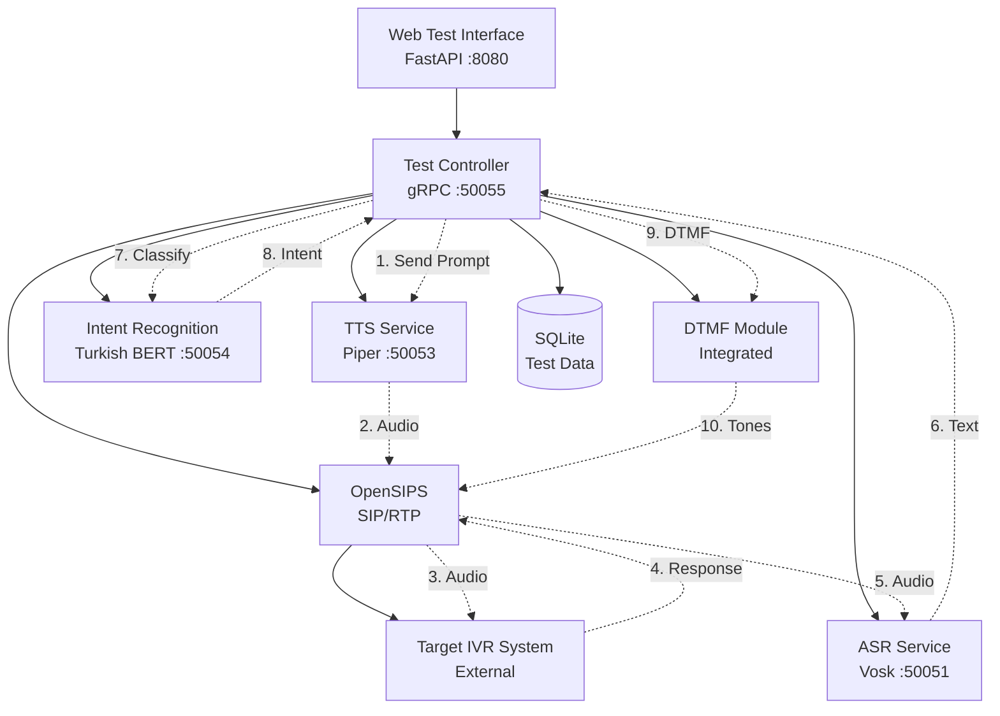

# Component Architecture

### New Components

#### Test Controller Service
**Responsibility:** Orchestrate end-to-end IVR test execution, coordinate between all services, and manage test state  
**Integration Points:** OpenSIPS (call initiation), ASR Service (transcription), TTS Service (prompts), Intent Recognition Service (validation), Web Interface (API)

**Key Interfaces:**
- `StartTestExecution(scenario_id)` → `execution_id`
- `GetExecutionStatus(execution_id)` → `TestExecutionStatus`
- `StopTestExecution(execution_id)` → `StopResult`
- `ListActiveExecutions()` → `List[ExecutionSummary]`

**Dependencies:**
- **Existing Components:** ASR Service (50051), TTS Service (50053), OpenSIPS SIP backend
- **New Components:** Intent Recognition Service (50054)

**Technology Stack:** Python FastAPI + gRPC client integrations, SQLite for test state, port 50055

#### Intent Recognition Service  
**Responsibility:** Classify IVR response transcripts using CPU-optimized Turkish BERT model  
**Integration Points:** Test Controller (classification requests), Training Data Management (model updates)

**Key Interfaces:**
- `ClassifyIntent(text)` → `IntentResult{intent, confidence}`
- `BatchClassify(texts[])` → `List[IntentResult]`
- `UpdateModel(training_data)` → `ModelUpdateResult`
- `GetSupportedIntents()` → `List[Intent]`

**Dependencies:**
- **Existing Components:** None (standalone text classification)
- **New Components:** Test Controller Service

**Technology Stack:** Python + Transformers + ONNX Runtime, Turkish BERT (dbmdz/bert-base-turkish-uncased), gRPC server on port 50054

#### Web Test Management Interface
**Responsibility:** Provide web UI for creating test scenarios, monitoring executions, and viewing results  
**Integration Points:** Test Controller Service (all test operations), SQLite (direct read access for reporting)

**Key Interfaces:**
- REST API endpoints for test scenario CRUD operations
- WebSocket connections for real-time test execution monitoring  
- File upload for training data management
- Dashboard views for test results and analytics

**Dependencies:**
- **Existing Components:** None (new web interface)
- **New Components:** Test Controller Service (primary API)

**Technology Stack:** FastAPI web framework, HTML/CSS/JavaScript frontend, WebSocket for real-time updates, port 8080 (reusing existing port)

#### DTMF Generation Module
**Responsibility:** Generate and send DTMF tones during test calls for IVR navigation  
**Integration Points:** Test Controller (DTMF commands), OpenSIPS (RTP stream injection)

**Key Interfaces:**
- `SendDTMF(call_id, tone_sequence, timing)` → `DTMFResult`
- `SendDTMFWithDelay(call_id, tone, delay_ms)` → `DTMFResult`
- `ValidateDTMFCapability(call_id)` → `CapabilityResult`

**Dependencies:**
- **Existing Components:** OpenSIPS RTP transport, Core RTP handling
- **New Components:** Test Controller Service

**Technology Stack:** Python audio processing, RTP tone injection, integrated into Test Controller service

### Component Interaction Diagram


