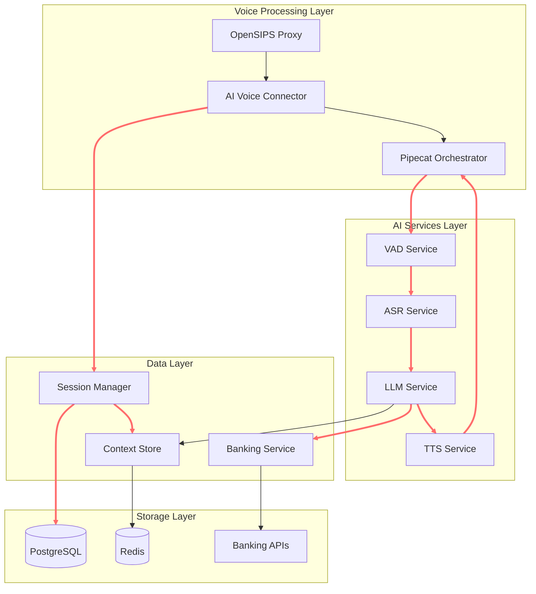

# Components

The system architecture is composed of specialized microservices, each with clearly defined responsibilities and interfaces.

### AI Voice Connector

**Responsibility:** Central orchestrator that bridges SIP/RTP telephony with the AI processing pipeline, managing call lifecycle and audio stream coordination.

**Key Interfaces:**
- gRPC service for session management and call control
- RTP audio stream ingestion and transmission
- Pipecat pipeline integration for audio processing
- OpenSIPS integration for SIP signaling

**Dependencies:** 
- OpenSIPS for SIP/RTP handling
- Pipecat Orchestrator for AI pipeline
- Session Manager for call state
- Audio codec libraries for PCMU/PCM conversion

**Technology Stack:** Python 3.11, FastAPI with gRPC, PyAudio, asyncio for real-time processing

### Pipecat Orchestrator

**Responsibility:** Manages the AI processing pipeline workflow, coordinating VAD, ASR, LLM, and TTS components with real-time streaming and barge-in support.

**Key Interfaces:**
- Pipecat framework API for pipeline configuration
- Audio stream processing with VAD integration
- gRPC clients for AI service communication
- Event-driven pipeline state management

**Dependencies:**
- VAD Service for speech detection
- ASR Service for speech-to-text
- LLM Service for language processing
- TTS Service for speech synthesis

**Technology Stack:** Python 3.11, Pipecat framework, asyncio, streaming audio protocols

### VAD Service

**Responsibility:** Real-time voice activity detection using Silero VAD to identify speech segments and silence periods for accurate audio processing.

**Key Interfaces:**
- gRPC service for VAD processing requests
- Audio chunk streaming input/output
- Configurable detection thresholds
- Real-time processing status reporting

**Dependencies:**
- Silero VAD model and inference engine
- Audio preprocessing utilities

**Technology Stack:** Python 3.11, Silero VAD, PyTorch, gRPC server

### ASR Service

**Responsibility:** Speech-to-text conversion with dual provider support (VOSK for local/cost-effective and Faster-Whisper for cloud/high-accuracy processing).

**Key Interfaces:**
- gRPC service with streaming audio input
- Token-level streaming output for low latency
- Provider selection API (VOSK vs Faster-Whisper)
- Confidence scoring and error handling

**Dependencies:**
- VOSK models for local processing
- Faster-Whisper for GPU acceleration
- Audio format conversion utilities

**Technology Stack:** Python 3.11, VOSK, Faster-Whisper, gRPC, CUDA (optional)

### LLM Service

**Responsibility:** Natural language understanding and response generation with support for both local LLaMA and cloud OpenAI providers, including banking-specific intent handling.

**Key Interfaces:**
- gRPC service for text processing
- Streaming token output for real-time responses
- Context-aware conversation management
- Banking intent classification and routing

**Dependencies:**
- LLaMA.cpp for local inference
- OpenAI API client for cloud processing
- Context Store for conversation memory
- Banking Service for domain-specific queries

**Technology Stack:** Python 3.11, LLaMA.cpp, OpenAI SDK, gRPC, GPU support

### TTS Service

**Responsibility:** Text-to-speech synthesis with dual provider support (Piper for local/consistent and ElevenLabs for cloud/premium quality).

**Key Interfaces:**
- gRPC service for text-to-audio conversion
- Streaming audio output for low latency
- Voice configuration and selection
- Audio format specification (PCM output)

**Dependencies:**
- Piper TTS models for local synthesis
- ElevenLabs API for cloud synthesis
- Audio encoding/format conversion

**Technology Stack:** Python 3.11, Piper TTS, ElevenLabs API, gRPC

### Session Manager

**Responsibility:** Manages call session lifecycle, state persistence, and coordination between all voice processing components.

**Key Interfaces:**
- gRPC service for session CRUD operations
- Real-time session state updates
- Call event notification and logging
- Session cleanup and timeout handling

**Dependencies:**
- PostgreSQL for persistent session storage
- Redis for session state caching
- Context Store for conversation data

**Technology Stack:** Python 3.11, FastAPI with gRPC, PostgreSQL, Redis, SQLAlchemy

### Context Store

**Responsibility:** High-performance storage and retrieval of conversation context, customer data caching, and memory management for multi-turn conversations.

**Key Interfaces:**
- gRPC service for context operations
- Real-time context updates and retrieval
- TTL-based automatic cleanup
- Context search and filtering

**Dependencies:**
- Redis for high-speed context caching
- PostgreSQL for persistent context history

**Technology Stack:** Python 3.11, Redis, gRPC, JSON serialization

### Banking Service

**Responsibility:** Integration layer for banking system APIs, handling customer authentication, card delivery inquiries, and other banking-specific operations.

**Key Interfaces:**
- gRPC service for banking operations
- Customer authentication and verification
- Card delivery status queries
- Secure banking API integration

**Dependencies:**
- Banking system APIs (external)
- Customer data validation services
- Security and compliance middleware

**Technology Stack:** Python 3.11, gRPC, HTTP clients for banking APIs, security libraries

### Component Diagrams


