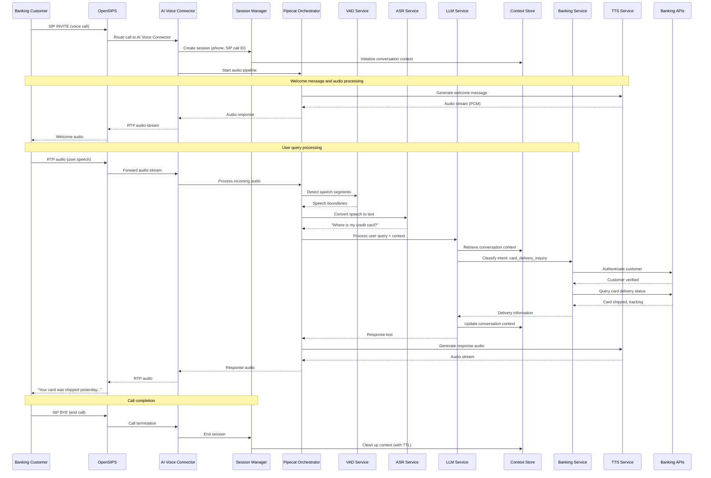

# Core Workflows

The following sequence diagrams illustrate critical system workflows for voice call processing and banking integration.

### Card Delivery Inquiry Workflow



### Barge-in Interruption Workflow

```mermaid
sequenceDiagram
    participant C as Banking Customer
    participant AVC as AI Voice Connector
    participant P as Pipecat Orchestrator
    participant VAD as VAD Service
    participant ASR as ASR Service
    participant TTS as TTS Service
    
    Note over C,TTS: System is speaking
    TTS->>P: Streaming TTS audio
    P->>AVC: Outbound audio stream
    
    parallel
        P->>VAD: Monitor for speech during TTS
    and
        C->>AVC: User interruption (RTP audio)
        AVC->>P: Incoming audio stream
        P->>VAD: Process interruption audio
        VAD->>P: Speech detected (confidence > threshold)
    end
    
    P->>TTS: STOP current synthesis
    TTS-->>P: Synthesis halted
    P->>ASR: Process interruption speech
    ASR-->>P: "Wait, I have a question"
    
    Note over P: Context preserved, ready for new query
    P->>VAD: Reset for new speech detection
```

