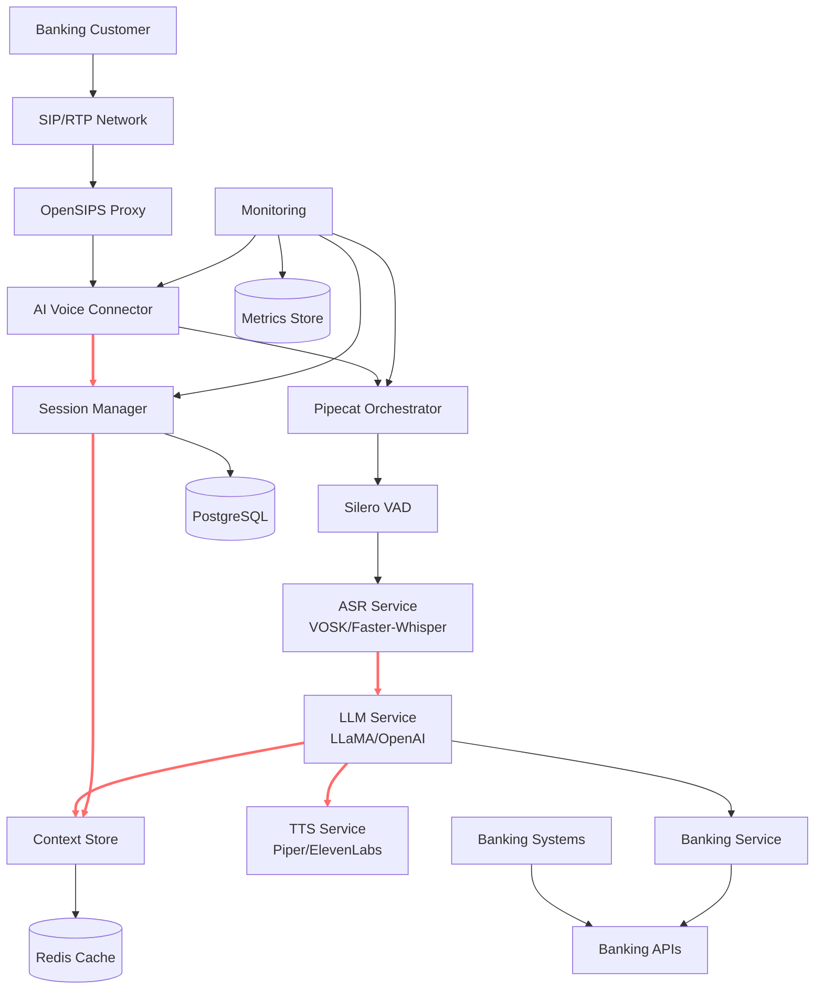

# High Level Architecture

### Technical Summary

The Pipecat IVR Voice Assistant employs a **microservices-within-monorepo architecture** centered around real-time audio processing pipelines. The system utilizes **gRPC for inter-service communication** and **Python-based AI/ML components** orchestrated by Pipecat. Key components include an AI Voice Connector service that bridges SIP/RTP telephony protocols with the AI pipeline, supporting both on-premise and cloud deployment scenarios. The architecture prioritizes **sub-700ms latency targets** through streaming architectures and efficient component orchestration, while maintaining **banking-grade security and reliability standards**.

### High Level Overview

**Architecture Style:** Microservices within Monorepo
- Individual services for AI Voice Connector, OpenSIPS proxy, and specialized AI pipeline components
- Unified codebase management while maintaining service boundaries
- gRPC-based service communication for type safety and performance

**Repository Structure:** Monorepo
- Centralized dependency management and tooling
- Simplified CI/CD pipeline coordination
- Shared libraries and configuration across services

**Service Architecture:** Event-driven microservices with real-time streaming
- OpenSIPS handles SIP signaling and RTP media relay
- AI Voice Connector orchestrates audio flow and session lifecycle
- Pipecat manages AI pipeline components (VAD → ASR → LLM → TTS)
- Session management service maintains conversation context

**Primary Data Flow:**
1. **Audio Ingestion:** SIP/RTP calls → OpenSIPS → AI Voice Connector
2. **Audio Processing:** PCMU/8000 → PCM conversion → Pipecat pipeline
3. **AI Processing:** VAD → ASR → LLM → TTS (with barge-in support)
4. **Audio Response:** TTS → PCM → PCMU/8000 → RTP transmission

**Key Architectural Decisions:**
- **gRPC over HTTP/REST:** For better performance and type safety in real-time scenarios
- **Dual AI Provider Support:** Local (LLaMA/Piper) and cloud (OpenAI/ElevenLabs) options
- **Containerized Deployment:** Docker orchestration for both on-premise and cloud environments
- **GPU Resource Management:** Dedicated inference services for optimal ML performance

### High Level Project Diagram

### Architectural and Design Patterns

The following architectural patterns guide the system design:

- **Event-Driven Architecture:** Audio events trigger processing pipelines with pub/sub messaging for component decoupling
  _Rationale:_ Supports real-time streaming requirements and enables horizontal scaling of AI components

- **Repository Pattern:** Abstract data access for session and context management 
  _Rationale:_ Enables testing isolation and future database migration flexibility

- **Circuit Breaker Pattern:** Fault tolerance for external API calls (banking services, cloud AI providers)
  _Rationale:_ Maintains system stability during external service outages, critical for banking reliability

- **Strategy Pattern:** Pluggable AI providers (local vs cloud for ASR, LLM, TTS)
  _Rationale:_ Allows runtime switching between cost-effective local processing and high-capability cloud services

- **Command Query Responsibility Segregation (CQRS):** Separate read/write models for session data
  _Rationale:_ Optimizes for high-frequency session updates and fast context retrieval

- **Gateway Pattern:** AI Voice Connector as unified entry point for telephony integration
  _Rationale:_ Centralizes SIP/RTP handling and provides consistent interface to AI pipeline

