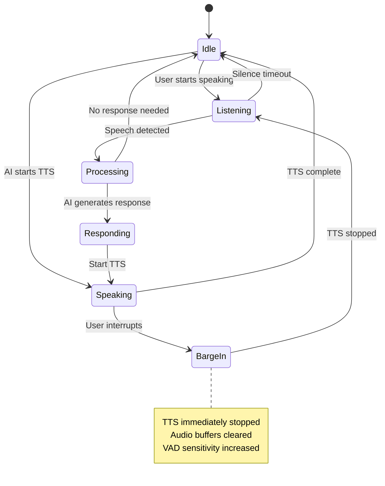

# Barge-in Flow Documentation

This document describes the barge-in (interrupt) functionality in the OpenSIPS AI Voice Connector, allowing users to interrupt AI speech and provide input.

## Overview

Barge-in enables natural conversation flow by allowing users to interrupt the AI while it's speaking, similar to human conversation patterns. The system uses Voice Activity Detection (VAD) to detect user speech and immediately stops TTS playback.

## State Diagram



## Detailed Flow States

### 1. Idle State
- **Description**: System waiting for input
- **Characteristics**:
  - No active TTS playback
  - VAD monitoring for speech
  - Low CPU usage
- **Transitions**:
  - → `Listening`: User speech detected
  - → `Speaking`: AI begins response

### 2. Listening State
- **Description**: Actively capturing user speech
- **Characteristics**:
  - VAD actively processing audio
  - STT engine receiving audio chunks
  - Echo cancellation active
- **Transitions**:
  - → `Processing`: End of speech detected
  - → `Idle`: Silence timeout (no speech)

### 3. Speaking State
- **Description**: AI is playing TTS audio
- **Characteristics**:
  - TTS audio streaming to user
  - VAD monitoring for interruption
  - Echo cancellation preventing self-detection
- **Transitions**:
  - → `BargeIn`: User speech detected
  - → `Idle`: TTS playback complete

### 4. BargeIn State
- **Description**: User interrupting AI speech
- **Characteristics**:
  - TTS immediately stopped
  - Audio buffers cleared
  - VAD sensitivity temporarily increased
- **Transitions**:
  - → `Listening`: Ready for user input

### 5. Processing State
- **Description**: AI processing user input
- **Characteristics**:
  - STT transcription complete
  - AI engine generating response
  - No audio playback
- **Transitions**:
  - → `Responding`: AI has response
  - → `Idle`: No response needed

### 6. Responding State
- **Description**: Preparing AI response
- **Characteristics**:
  - TTS synthesis starting
  - Audio buffers being filled
- **Transitions**:
  - → `Speaking`: TTS playback begins

## Implementation Details

### VAD Configuration for Barge-in

```python
class AdaptiveVADDetector:
    def __init__(self):
        # Barge-in specific settings
        self.barge_in_threshold = 0.25  # Lower threshold during TTS
        self.normal_threshold = 0.30    # Normal threshold
        self.barge_in_debounce = 1      # Faster response during TTS
        self.normal_debounce = 3        # Normal debounce frames
        
    async def is_speech(self, audio_tensor: torch.Tensor) -> bool:
        # Adjust sensitivity based on TTS state
        if self.is_tts_active:
            self.threshold = self.barge_in_threshold
            self.speech_debounce_frames = self.barge_in_debounce
        else:
            self.threshold = self.normal_threshold
            self.speech_debounce_frames = self.normal_debounce
            
        return await super().is_speech(audio_tensor)
```

### TTS Interruption Mechanism

```python
class TTSProcessor:
    async def generate_and_queue_tts_audio(self, text: str) -> bool:
        self._interrupt_event.clear()
        
        try:
            async for audio_chunk in self.tts_engine.synthesize_speech(text):
                # Check for interruption before processing each chunk
                if self._interrupt_event.is_set():
                    logging.info("TTS interrupted by user")
                    raise asyncio.CancelledError("TTS interrupted")
                    
                # Process and queue audio chunk
                await self._process_audio_chunk_pipeline(audio_chunk)
                
        except asyncio.CancelledError:
            # Clean up on interruption
            self._clear_audio_buffers()
            return False
            
    def interrupt(self) -> None:
        """Immediately stop TTS and clear buffers"""
        self._interrupt_event.set()
        self._clear_audio_buffers()
```

### Echo Cancellation During Barge-in

```python
class AdaptiveVADDetector:
    def register_tts_audio(self, tts_audio: torch.Tensor) -> None:
        """Register TTS audio for echo cancellation"""
        self.recent_tts_audio.append(tts_audio.detach().clone())
        self.is_tts_active = True
        
    async def _should_ignore_due_to_echo(self, audio_tensor: torch.Tensor) -> bool:
        """Enhanced echo detection during barge-in scenarios"""
        if not self.is_tts_active:
            return False
            
        # Use WebRTC VAD for additional verification during TTS
        is_noise, noise_frames, total_frames = await self._webrtc_vad_check(audio_tensor)
        
        # If WebRTC detects significant speech during TTS, it's likely real speech
        if total_frames > 0:
            speech_ratio = (total_frames - noise_frames) / total_frames
            if speech_ratio > 0.6:  # High confidence speech
                return False  # Don't ignore, this is real speech
                
        return True  # Likely echo, ignore
```

## Timing Considerations

### Critical Timing Windows

| Event | Target Time | Maximum Time | Impact if Exceeded |
|-------|-------------|--------------|-------------------|
| VAD Detection | 50ms | 100ms | Delayed barge-in response |
| TTS Interruption | 10ms | 50ms | Audio overlap/artifacts |
| Buffer Clearing | 5ms | 20ms | Audio glitches |
| State Transition | 1ms | 10ms | State confusion |

### Performance Optimizations

1. **Async Processing**:
   ```python
   # Heavy VAD computations in thread pool
   metrics = await asyncio.to_thread(self._compute_audio_metrics_sync, audio_tensor)
   
   # TTS processing pipeline
   pcmu_chunk = await self._process_audio_chunk_pipeline(audio_chunk)
   ```

2. **Buffer Management**:
   ```python
   # Pre-allocated buffers for low latency
   self.audio_buffer = bytearray(1600)  # 100ms at 8kHz
   self.rtp_buffer = bytearray(160)     # 20ms RTP packet
   ```

3. **Priority Queuing**:
   ```python
   # High priority for barge-in events
   if barge_in_detected:
       await self.high_priority_queue.put(interrupt_event)
   else:
       await self.normal_queue.put(audio_event)
   ```

## Configuration Parameters

### VAD Sensitivity

```ini
[adaptive_vad]
# Normal operation
normal_threshold = 0.30
normal_debounce_frames = 3
normal_silence_frames = 2

# Barge-in mode (during TTS)
barge_in_threshold = 0.25
barge_in_debounce_frames = 1
barge_in_silence_frames = 1

# Echo cancellation
echo_cancellation_enabled = true
tts_cooldown_ms = 300
```

### TTS Interruption

```ini
[tts_processor]
# Interruption settings
interrupt_check_interval_ms = 10
buffer_clear_timeout_ms = 50
graceful_stop_timeout_ms = 100

# Audio quality
fade_out_duration_ms = 20
anti_click_filter = true
```

## Troubleshooting Barge-in Issues

### Common Problems

1. **Delayed Barge-in Response**:
   ```bash
   # Check VAD processing time
   grep "VAD processing time" /var/log/oavc.log
   
   # Monitor CPU usage during VAD
   top -p $(pgrep -f "python.*engine.py")
   ```

2. **False Barge-in Triggers**:
   ```bash
   # Check echo cancellation effectiveness
   grep "echo.*detected" /var/log/oavc.log
   
   # Analyze VAD threshold adjustments
   grep "threshold.*adjusted" /var/log/oavc.log
   ```

3. **Audio Artifacts During Interruption**:
   ```bash
   # Check TTS interruption timing
   grep "TTS.*interrupt" /var/log/oavc.log
   
   # Monitor buffer clearing
   grep "buffer.*clear" /var/log/oavc.log
   ```

### Diagnostic Commands

```bash
# Monitor barge-in events in real-time
tail -f /var/log/oavc.log | grep -E "(barge.in|interrupt|VAD)"

# Check VAD performance metrics
curl -s http://localhost:8080/metrics | grep vad_

# Test barge-in response time
python test_barge_in_latency.py --target-latency 50ms
```

### Performance Tuning

1. **Reduce VAD Latency**:
   ```python
   # Smaller audio chunks for faster processing
   vad_chunk_size = 320  # 20ms at 16kHz (was 480)
   
   # Parallel VAD processing
   vad_workers = 2
   ```

2. **Optimize TTS Interruption**:
   ```python
   # More frequent interruption checks
   interrupt_check_interval = 0.005  # 5ms (was 10ms)
   
   # Immediate buffer clearing
   clear_buffers_immediately = True
   ```

3. **Echo Cancellation Tuning**:
   ```python
   # Shorter TTS history for faster processing
   tts_history_duration = 2.0  # 2 seconds (was 5 seconds)
   
   # Adaptive echo threshold
   echo_threshold_adaptive = True
   ```

## Testing Barge-in Functionality

### Automated Tests

```python
@pytest.mark.asyncio
async def test_barge_in_response_time():
    """Test barge-in response time is under 100ms"""
    # Start TTS playback
    tts_task = asyncio.create_task(tts_processor.generate_audio("Long text..."))
    await asyncio.sleep(0.5)  # Let TTS start
    
    # Simulate user speech
    start_time = time.time()
    vad_detector.simulate_speech_detection()
    
    # Wait for TTS interruption
    await tts_task
    response_time = time.time() - start_time
    
    assert response_time < 0.1, f"Barge-in too slow: {response_time:.3f}s"

@pytest.mark.asyncio
async def test_echo_cancellation():
    """Test that TTS audio doesn't trigger false barge-in"""
    # Register TTS audio
    tts_audio = generate_test_tts_audio()
    vad_detector.register_tts_audio(tts_audio)
    
    # Feed TTS audio back to VAD
    speech_detected = await vad_detector.is_speech(tts_audio)
    
    assert not speech_detected, "TTS audio incorrectly detected as speech"
```

### Manual Testing Scenarios

1. **Basic Barge-in**:
   - Start conversation with AI
   - Let AI begin speaking
   - Interrupt with "Stop" or "Wait"
   - Verify immediate TTS stop

2. **Rapid Interruptions**:
   - Interrupt AI multiple times quickly
   - Verify system stability
   - Check for audio artifacts

3. **Edge Cases**:
   - Very quiet interruptions
   - Loud background noise
   - Multiple speakers
   - Network latency scenarios

## Best Practices

### For Developers

1. **Always use async/await** for VAD and TTS operations
2. **Implement proper error handling** for interruption scenarios
3. **Monitor performance metrics** in production
4. **Test with real audio** not just synthetic data

### For Deployment

1. **Tune VAD thresholds** for your specific environment
2. **Monitor barge-in response times** with metrics
3. **Set appropriate timeouts** for your use case
4. **Test with various audio conditions** before production 