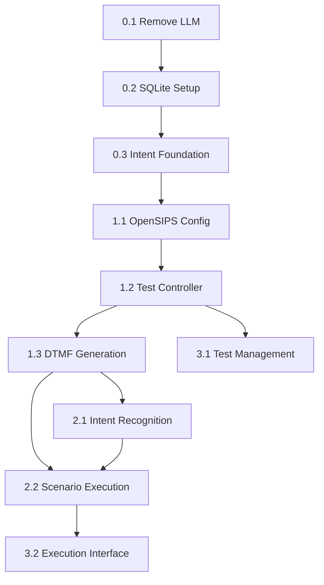

# IVR Flow Automation System - Complete Story Suite

## Overview
This directory contains all user stories for transforming the OpenSIPS AI Voice Connector into an IVR Flow Automation System. The stories are organized into phases to ensure a safe, incremental transformation while preserving existing functionality.

## Story Organization

### Phase 0: Preparation & Refactoring (0.x Series)
Preparatory stories that simplify the architecture and remove dependencies before implementing IVR functionality.

- **[0.1 Remove LLM Service Dependencies](0.1.remove-llm-service.md)**
  - Remove LLM service and GPU dependencies
  - Simplify architecture for CPU-only deployment
  - Preserve ASR/TTS functionality

- **[0.2 Setup SQLite Database Infrastructure](0.2.setup-sqlite-database.md)**
  - Create data storage foundation for test scenarios
  - Implement database schema for test data
  - Set up Docker volume persistence

- **[0.3 Create Intent Recognition Service Foundation](0.3.intent-service-foundation.md)**
  - Create gRPC service structure for intent recognition
  - Set up foundation for Turkish BERT integration
  - Prepare port 50054 for intent service

### Phase 1: Epic 1 - OpenSIPS Outbound Call Foundation (1.x Series)
Core telephony capabilities for outbound IVR testing.

- **[1.1 OpenSIPS Outbound Configuration](1.1.opensips-outbound-configuration.md)**
  - Configure OpenSIPS for outbound SIP calls
  - Set up SIP trunk and call control interfaces
  - Enable bidirectional RTP audio streams

- **[1.2 Test Controller Service](1.2.test-controller-service.md)**
  - Create central orchestration service
  - Integrate with OpenSIPS, ASR, and TTS services
  - Implement basic test execution capabilities

- **[1.3 DTMF Tone Generation](1.3.dtmf-tone-generation.md)**
  - Add DTMF tone generation for IVR navigation
  - Integrate DTMF with RTP audio streams
  - Support timing control and sequence management

### Phase 2: Epic 2 - Simple Test Framework (2.x Series)
AI-powered test validation and scenario execution.

- **[2.1 Turkish BERT Intent Recognition](2.1.turkish-bert-intent-recognition.md)**
  - Integrate Turkish BERT for IVR response classification
  - Implement CPU-optimized inference pipeline
  - Create training data management for IVR intents

- **[2.2 Test Scenario Execution](2.2.test-scenario-execution.md)**
  - Implement step-by-step test execution engine
  - Add conditional logic and branching
  - Create comprehensive result reporting

### Phase 3: Epic 3 - Basic Web Interface (3.x Series)
User-friendly web interface for test management and monitoring.

- **[3.1 Test Management Interface](3.1.test-management-interface.md)**
  - Create web interface for scenario CRUD operations
  - Implement forms for test configuration
  - Add scenario list view and search capabilities

- **[3.2 Test Execution Interface](3.2.test-execution-interface.md)**
  - Add real-time test execution monitoring
  - Implement WebSocket for live updates
  - Create results dashboard and logging

## Implementation Order & Dependencies

### Recommended Implementation Sequence

1. **Phase 0 (Preparation)** - Execute in order
   - 0.1 → 0.2 → 0.3
   - Each story prepares foundation for next phases
   - Validates system simplification before adding complexity

2. **Phase 1 (Core Foundation)** - Execute in order
   - 1.1 → 1.2 → 1.3
   - OpenSIPS configuration enables Test Controller
   - DTMF generation completes call interaction capabilities

3. **Phase 2 (Intelligence)** - Can be parallel
   - 2.1 and 2.2 can be developed simultaneously
   - 2.1 provides intent recognition for 2.2 test validation

4. **Phase 3 (Interface)** - Can be parallel  
   - 3.1 and 3.2 can be developed simultaneously
   - Both depend on completed Phase 1 and 2 functionality

### Critical Dependencies



## Key Integration Points

### Service Architecture
- **ASR Service (50051)**: Existing - used for IVR response transcription
- **TTS Service (50053)**: Existing - used for IVR prompt generation
- **Intent Service (50054)**: New - Turkish BERT intent classification
- **Test Controller (50055)**: New - orchestration and execution management

### Data Flow
```
TTS → OpenSIPS → IVR → OpenSIPS → ASR → Intent Recognition → Test Validation
```

### Database Schema
- **test_scenarios**: Test scenario definitions and steps
- **test_executions**: Execution tracking and results
- **step_executions**: Step-by-step execution details
- **intent_training_data**: Turkish BERT training data

## Development Guidelines

### Testing Standards
- Each story includes comprehensive testing requirements
- Follow existing pytest patterns and test organization
- Maintain existing test coverage standards
- Include integration testing for service interactions

### Code Standards
- Follow existing Python PEP 8 style guidelines
- Maintain existing gRPC service patterns
- Preserve Docker containerization approaches
- Use existing configuration management patterns

### Safety Measures
- Preserve existing ASR/TTS service functionality throughout transformation
- Maintain backward compatibility where possible
- Implement comprehensive error handling and recovery
- Add monitoring and observability for new services

## Success Criteria

### Phase 0 Completion
- [ ] LLM service completely removed
- [ ] SQLite database operational
- [ ] Intent service foundation ready
- [ ] Existing ASR/TTS services unaffected

### Phase 1 Completion
- [ ] OpenSIPS makes successful outbound calls
- [ ] Test Controller orchestrates basic call flows
- [ ] DTMF navigation works with target IVR systems
- [ ] End-to-end call-and-transcribe capability

### Phase 2 Completion
- [ ] Turkish BERT classifies IVR responses accurately
- [ ] Test scenarios execute step-by-step successfully
- [ ] Pass/fail determination works correctly
- [ ] Comprehensive execution reporting available

### Phase 3 Completion
- [ ] Web interface manages test scenarios effectively
- [ ] Real-time execution monitoring functions properly
- [ ] Results dashboard provides actionable insights
- [ ] Complete IVR testing workflow operational

## Final System Capabilities

Upon completion of all stories, the system will provide:

1. **Automated IVR Testing**: Complete automation of IVR system validation
2. **Turkish Language Support**: Native Turkish BERT for accurate intent recognition
3. **Real-time Monitoring**: Live execution monitoring and progress tracking
4. **Comprehensive Reporting**: Detailed test results and analytics
5. **User-friendly Interface**: Web-based test management and monitoring
6. **Scalable Architecture**: CPU-only deployment with service isolation
7. **Flexible Test Scenarios**: Conditional logic and complex test workflows

---

**Next Step**: Begin implementation with Story 0.1 - Remove LLM Service Dependencies